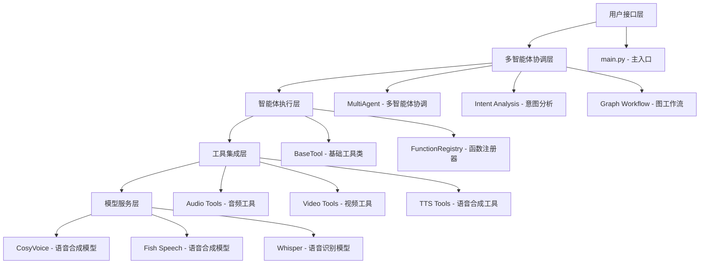
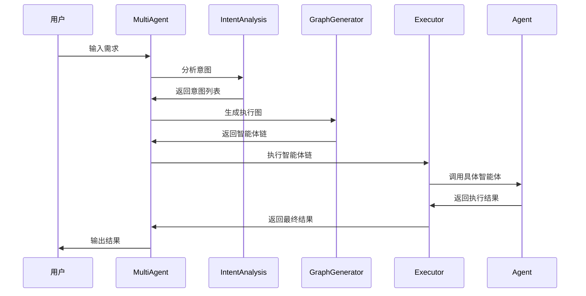

# 02-项目结构分析

## 概述

本文档将深入分析VideoAgent项目的整体架构和核心组件，帮助您理解项目的组织结构和各模块之间的关系。

## 项目整体架构

VideoAgent采用分层架构设计，主要包含以下层次：



## 目录结构详解

### 根目录文件

```
VideoAgent/
├── main.py                 # 主程序入口
├── pyproject.toml          # 项目配置和依赖
├── requirements.txt        # Python依赖列表
├── readme.md              # 英文说明文档
├── readme_zh.md           # 中文说明文档
├── demos_documents.md     # 演示文档
└── LICENSE                # 开源许可证
```

**核心知识点：**
- `main.py` 是整个系统的入口点，负责初始化多智能体系统
- `pyproject.toml` 使用现代Python项目配置标准，包含依赖管理和构建配置
- `requirements.txt` 提供传统的依赖安装方式

### environment/ 目录

```
environment/
├── __init__.py
├── agents/                 # 智能体核心模块
│   ├── __init__.py
│   ├── base.py            # 基础工具类和注册器
│   └── multi.py           # 多智能体协调器
├── config/                # 配置文件
│   ├── __init__.py
│   ├── config.yml         # 主配置文件
│   ├── intents.yml        # 意图映射配置
│   ├── graph.txt          # 图工作流提示词
│   ├── llm.py            # LLM配置
│   ├── check.py          # 配置检查
│   └── registry.json     # 工具注册表
└── roles/                 # 具体智能体实现
    ├── __init__.py
    ├── audio_extractor.py
    ├── transcriber.py
    ├── tts/              # 语音合成相关
    ├── svc/              # 语音转换相关
    ├── vid_*             # 视频处理相关
    └── ...
```

**核心知识点：**
- `agents/` 包含多智能体系统的核心逻辑
- `config/` 集中管理所有配置文件和提示词模板
- `roles/` 包含具体的智能体实现，每个文件代表一个专业功能

### tools/ 目录

```
tools/
├── CosyVoice/            # 语音合成工具
├── fish-speech/          # Fish Speech语音合成
├── seed-vc/              # 语音转换工具
├── DiffSinger/           # 歌声合成工具
├── ImageBind/            # 多模态理解工具
├── videorag/             # 视频检索工具
└── audio-preprocess/     # 音频预处理工具
```

**核心知识点：**
- 每个工具目录都是独立的第三方项目
- 工具之间通过VideoAgent的智能体系统进行协调
- 支持多种语音合成和视频处理技术

## 核心组件分析

### 1. 多智能体协调系统 (MultiAgent)

**文件位置：** `environment/agents/multi.py`

**核心功能：**
- 意图分析和智能体选择
- 图工作流生成和执行
- 智能体链的协调管理

**关键类和方法：**
- `MultiAgent` 类：多智能体系统的主控制器
- `intents_analysis()` 方法：分析用户意图
- `generate_agent_graph()` 方法：生成执行图
- `execute_agent_chain()` 方法：执行智能体链

**实现思路：**
1. 用户输入需求后，系统首先进行意图分析
2. 根据意图选择相应的智能体工具
3. 生成图工作流，确定执行顺序
4. 按顺序执行智能体链，传递参数和结果

### 2. 基础工具框架 (BaseTool)

**文件位置：** `environment/agents/base.py`

**核心功能：**
- 定义智能体基础接口
- 自动注册和发现工具
- 参数验证和类型检查

**关键类：**
- `BaseTool` 类：所有智能体的基类
- `FunctionRegistry` 类：工具注册和管理器

**实现思路：**
1. 使用Pydantic进行参数验证
2. 通过装饰器模式自动注册工具
3. 支持动态发现和加载工具类

### 3. 意图分析系统

**配置文件：** `environment/config/intents.yml`

**核心功能：**
- 将用户需求映射到具体功能
- 支持多意图组合
- 智能体工具选择

**意图类型：**
- 音频处理：Loudness Normalization, Audio Resample, Vocal Separation
- 语音合成：Text-to-Speech, Singing Voice Conversion
- 视频编辑：Video Edit, Rhythm-cut, Commentary
- 内容生成：Creative Writing, News, Stand-up Comedy

### 4. 图工作流系统

**配置文件：** `environment/config/graph.txt`

**核心功能：**
- 动态生成执行图
- 智能体间的参数传递
- 工作流验证和优化

**工作流程：**
1. 分析用户需求
2. 选择相关智能体
3. 生成执行图
4. 验证图的有效性
5. 执行智能体链

## 智能体实现分析

### 音频处理智能体

**AudioExtractor (音频提取器)**
- 功能：从视频中提取音频
- 输入：视频文件路径
- 输出：音频文件路径

**Transcriber (转录器)**
- 功能：将音频转换为文本
- 输入：音频文件路径
- 输出：转录文本

**LoudnessNormalizer (响度标准化器)**
- 功能：标准化音频响度
- 输入：音频文件路径
- 输出：标准化后的音频文件

### 语音合成智能体

**TTSWriter (TTS写入器)**
- 功能：将文本转换为语音
- 输入：文本内容、语音参数
- 输出：生成的语音文件

**TTSInfer (TTS推理器)**
- 功能：执行语音合成推理
- 输入：文本、模型参数
- 输出：合成语音

### 视频处理智能体

**VideoEditor (视频编辑器)**
- 功能：编辑和合成视频
- 输入：视频片段、编辑参数
- 输出：编辑后的视频

**VideoSearcher (视频搜索器)**
- 功能：搜索相关视频片段
- 输入：搜索查询、视频库
- 输出：匹配的视频片段

## 配置系统分析

### 主配置文件 (config.yml)

**LLM配置：**
- DeepSeek：用于视频重混音、TTS、SVC等
- Claude：用于智能体图路由
- GPT：用于视频编辑、概览、摘要等
- Gemini：用于多模态理解

### 意图映射 (intents.yml)

**映射结构：**
```yaml
意图名称:
  - 智能体1
  - 智能体2
  - ...
```

**示例：**
```yaml
Text-to-Speech:
  - AudioExtractor
  - TTSSlicer
  - Transcriber
  - TTSWriter
  - TTSInfer
  - TTSReplace
```

## 数据流分析

### 典型执行流程



### 参数传递机制

1. **用户输入** → 智能体输入参数
2. **智能体输出** → 下游智能体输入
3. **上下文管理** → 全局状态维护
4. **错误处理** → 异常传播和恢复

## 扩展性分析

### 添加新智能体

1. **创建智能体类**：继承BaseTool
2. **定义输入输出模式**：使用Pydantic
3. **实现execute方法**：核心业务逻辑
4. **更新意图映射**：在intents.yml中添加

### 添加新工具

1. **集成第三方工具**：放入tools/目录
2. **创建包装智能体**：封装工具接口
3. **更新配置**：添加相关配置项
4. **测试验证**：确保功能正常

## 测试策略

### 单元测试

**测试目标：**
- 每个智能体的独立功能
- 参数验证和类型检查
- 错误处理和异常情况

**测试方法：**
- 创建测试用例文件
- 模拟输入输出
- 验证功能正确性

### 集成测试

**测试目标：**
- 智能体间的协作
- 参数传递的正确性
- 端到端工作流

**测试方法：**
- 创建完整工作流测试
- 验证中间结果
- 检查最终输出

### 性能测试

**测试目标：**
- 系统响应时间
- 内存使用情况
- 并发处理能力

**测试方法：**
- 压力测试
- 性能监控
- 资源使用分析

## 下一步

理解项目结构后，请继续阅读：
- [03-多智能体框架](./03-multi-agent-framework.md)
- [04-意图分析系统](./04-intent-analysis.md)

## 知识点总结

1. **分层架构**：用户接口 → 多智能体协调 → 智能体执行 → 工具集成 → 模型服务
2. **模块化设计**：每个智能体独立实现，通过统一接口协作
3. **配置驱动**：通过配置文件控制行为，支持灵活调整
4. **图工作流**：动态生成执行图，支持复杂任务编排
5. **扩展性**：易于添加新智能体和工具

通过理解这些核心概念，您将能够更好地复现和扩展VideoAgent系统。
