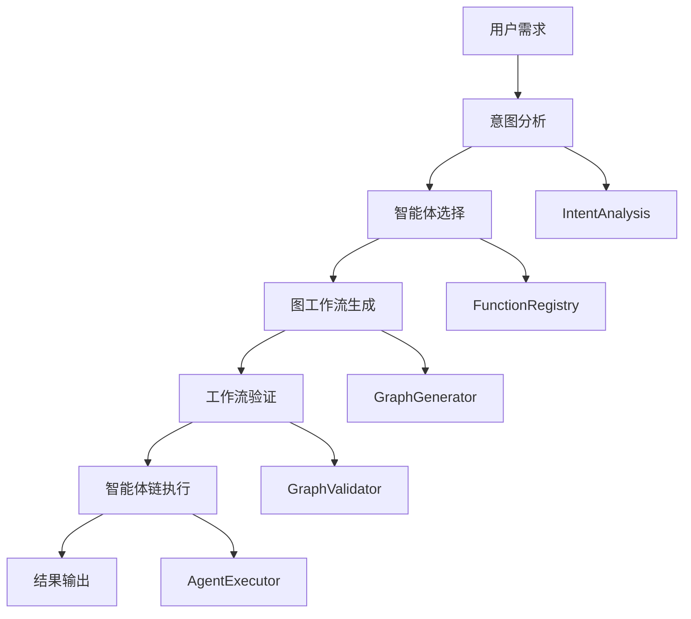

# 03-多智能体框架

## 概述

多智能体框架是VideoAgent的核心组件，负责协调多个专业智能体来完成复杂的视频处理任务。本文档将详细指导您如何复现这个强大的协调系统。

## 核心概念

### 智能体 (Agent)
智能体是系统中的基本执行单元，每个智能体负责特定的功能，如音频提取、语音合成、视频编辑等。

### 多智能体协调 (Multi-Agent Coordination)
通过意图分析、图工作流生成和智能体链执行，实现多个智能体的协调工作。

### 图工作流 (Graph Workflow)
将复杂的任务分解为智能体图，定义执行顺序和参数传递关系。

## 架构设计



## 步骤1：基础工具框架复现

### 1.1 创建BaseTool基类

**知识点：**
- 使用Pydantic进行参数验证
- 定义统一的智能体接口
- 支持输入输出模式定义

**实现思路：**
1. 创建BaseTool抽象基类
2. 定义InputSchema和OutputSchema
3. 实现参数验证和类型检查
4. 提供execute方法接口

**测试方法：**
- 创建测试智能体类继承BaseTool
- 验证参数验证功能
- 测试execute方法调用

### 1.2 实现FunctionRegistry注册器

**知识点：**
- 自动发现和注册智能体
- 维护智能体元数据
- 支持动态加载

**实现思路：**
1. 扫描指定目录下的智能体类
2. 自动提取智能体元数据
3. 维护注册表数据结构
4. 提供查询和获取接口

**测试方法：**
- 创建多个测试智能体
- 验证自动注册功能
- 测试元数据提取准确性

## 步骤2：意图分析系统复现

### 2.1 意图分析器实现

**知识点：**
- 使用LLM进行意图识别
- 支持多意图组合
- 实现意图到智能体的映射

**实现思路：**
1. 定义意图分析提示词模板
2. 调用LLM进行意图识别
3. 解析LLM返回结果
4. 映射到具体智能体工具

**测试方法：**
- 准备测试用例（不同复杂度的用户需求）
- 验证意图识别准确性
- 测试多意图处理能力

### 2.2 意图配置文件管理

**知识点：**
- YAML配置文件解析
- 意图到智能体的映射关系
- 配置热更新支持

**实现思路：**
1. 设计intents.yml配置文件结构
2. 实现配置加载和解析
3. 提供配置查询接口
4. 支持配置动态更新

**测试方法：**
- 创建测试配置文件
- 验证配置解析正确性
- 测试配置更新功能

## 步骤3：图工作流生成器复现

### 3.1 图工作流设计器

**知识点：**
- 使用LLM生成执行图
- 定义智能体间的依赖关系
- 支持参数传递和连接

**实现思路：**
1. 设计图工作流提示词模板
2. 调用LLM生成执行图
3. 解析图结构数据
4. 验证图的完整性

**测试方法：**
- 准备不同复杂度的任务
- 验证图生成质量
- 测试图结构解析

### 3.2 工作流验证器

**知识点：**
- 验证执行图的可行性
- 检查参数传递的正确性
- 识别冗余和冲突

**实现思路：**
1. 实现图结构验证算法
2. 检查参数类型匹配
3. 验证执行顺序合理性
4. 提供验证结果和反馈

**测试方法：**
- 创建有效和无效的测试图
- 验证验证器准确性
- 测试错误检测能力

## 步骤4：智能体链执行器复现

### 4.1 执行器核心逻辑

**知识点：**
- 按顺序执行智能体链
- 管理参数传递和上下文
- 处理执行异常和错误

**实现思路：**
1. 实现智能体链执行逻辑
2. 管理执行上下文和状态
3. 处理参数传递和结果收集
4. 实现错误处理和恢复

**测试方法：**
- 创建测试智能体链
- 验证执行顺序正确性
- 测试参数传递准确性

### 4.2 上下文管理器

**知识点：**
- 维护全局执行状态
- 管理智能体间的数据传递
- 支持状态持久化

**实现思路：**
1. 设计上下文数据结构
2. 实现状态管理接口
3. 支持数据序列化和反序列化
4. 提供状态查询和更新方法

**测试方法：**
- 创建复杂执行场景
- 验证状态管理正确性
- 测试数据传递准确性

## 步骤5：多智能体协调器复现

### 5.1 MultiAgent主控制器

**知识点：**
- 整合所有子系统
- 实现完整的处理流程
- 提供统一的对外接口

**实现思路：**
1. 整合意图分析、图生成、执行等模块
2. 实现完整的处理流程
3. 提供错误处理和重试机制
4. 实现用户交互接口

**测试方法：**
- 创建端到端测试用例
- 验证完整流程正确性
- 测试错误处理能力

### 5.2 反射和优化机制

**知识点：**
- 实现自我反思和优化
- 支持工作流迭代改进
- 提供性能监控和调优

**实现思路：**
1. 实现执行结果分析
2. 提供优化建议生成
3. 支持工作流重新生成
4. 实现性能指标收集

**测试方法：**
- 创建需要优化的场景
- 验证反思机制有效性
- 测试优化效果

## 步骤6：错误处理和恢复

### 6.1 异常处理机制

**知识点：**
- 捕获和处理各种异常
- 提供详细的错误信息
- 支持优雅降级

**实现思路：**
1. 定义异常类型和处理策略
2. 实现异常捕获和记录
3. 提供错误恢复机制
4. 支持用户友好的错误提示

**测试方法：**
- 故意触发各种异常
- 验证异常处理正确性
- 测试恢复机制有效性

### 6.2 重试和容错

**知识点：**
- 实现智能重试机制
- 支持部分失败恢复
- 提供容错策略

**实现思路：**
1. 设计重试策略和规则
2. 实现状态保存和恢复
3. 支持断点续传
4. 提供降级方案

**测试方法：**
- 模拟网络中断等故障
- 验证重试机制有效性
- 测试容错能力

## 步骤7：性能优化

### 7.1 并发执行优化

**知识点：**
- 识别可并行的智能体
- 实现并发执行机制
- 优化资源利用率

**实现思路：**
1. 分析智能体依赖关系
2. 识别并行执行机会
3. 实现并发执行框架
4. 优化资源分配

**测试方法：**
- 创建可并行的测试场景
- 验证并发执行正确性
- 测试性能提升效果

### 7.2 缓存和优化

**知识点：**
- 实现结果缓存机制
- 优化重复计算
- 提供智能预加载

**实现思路：**
1. 设计缓存策略和数据结构
2. 实现缓存管理和清理
3. 支持预加载和预测
4. 优化内存使用

**测试方法：**
- 创建重复计算场景
- 验证缓存机制有效性
- 测试性能提升效果

## 单元测试指南

### 测试文件结构

```
tests/
├── test_base_tool.py          # BaseTool测试
├── test_function_registry.py  # FunctionRegistry测试
├── test_intent_analysis.py     # 意图分析测试
├── test_graph_generator.py     # 图生成器测试
├── test_agent_executor.py      # 执行器测试
├── test_multi_agent.py        # 多智能体测试
└── test_integration.py        # 集成测试
```

### 测试用例设计

**BaseTool测试：**
- 参数验证测试
- 类型检查测试
- 接口实现测试

**FunctionRegistry测试：**
- 自动注册测试
- 元数据提取测试
- 查询功能测试

**意图分析测试：**
- 单意图识别测试
- 多意图组合测试
- 边界情况测试

**图生成器测试：**
- 简单图生成测试
- 复杂图生成测试
- 图验证测试

**执行器测试：**
- 顺序执行测试
- 参数传递测试
- 异常处理测试

### 测试数据准备

**测试用例：**
- 简单任务：单一智能体执行
- 中等任务：2-3个智能体协作
- 复杂任务：5+个智能体协作

**测试数据：**
- 模拟音频文件
- 模拟视频文件
- 测试文本内容

## 集成测试指南

### 端到端测试

**测试流程：**
1. 准备测试环境和数据
2. 执行完整处理流程
3. 验证中间结果和最终输出
4. 检查性能指标

**测试场景：**
- 音频转录任务
- 视频编辑任务
- 语音合成任务
- 复杂多模态任务

### 性能测试

**测试指标：**
- 响应时间
- 内存使用
- CPU利用率
- 并发处理能力

**测试工具：**
- 性能监控工具
- 压力测试工具
- 资源使用分析工具

## 部署和运维

### 配置管理

**配置文件：**
- 智能体配置
- LLM配置
- 系统参数配置

**环境变量：**
- API密钥管理
- 路径配置
- 调试模式设置

### 监控和日志

**监控指标：**
- 执行成功率
- 平均响应时间
- 错误率统计

**日志记录：**
- 执行日志
- 错误日志
- 性能日志

## 故障排除

### 常见问题

**1. 智能体注册失败**
- 检查智能体类定义
- 验证继承关系
- 检查导入路径

**2. 意图分析不准确**
- 调整提示词模板
- 检查LLM配置
- 优化意图映射

**3. 图生成失败**
- 检查智能体元数据
- 验证参数类型匹配
- 调整图生成策略

**4. 执行异常**
- 检查参数传递
- 验证智能体实现
- 查看错误日志

### 调试技巧

**调试工具：**
- 日志分析工具
- 性能分析工具
- 调试器

**调试方法：**
- 添加详细日志
- 使用断点调试
- 分析执行轨迹

## 下一步

完成多智能体框架复现后，请继续阅读：
- [04-意图分析系统](./04-intent-analysis.md)
- [05-图驱动工作流](./05-graph-workflow.md)

## 知识点总结

1. **模块化设计**：每个组件独立实现，通过接口协作
2. **配置驱动**：通过配置文件控制行为，支持灵活调整
3. **错误处理**：完善的异常处理和恢复机制
4. **性能优化**：支持并发执行和缓存优化
5. **可扩展性**：易于添加新智能体和功能

通过系统性地复现多智能体框架，您将掌握现代AI系统的核心设计理念和实现方法。
