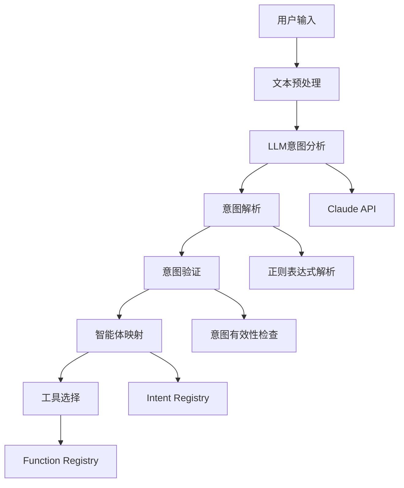

# 04-意图分析系统

## 概述

意图分析系统是VideoAgent的核心组件之一，负责理解用户的自然语言需求并将其映射到具体的功能模块。本系统通过LLM的强大理解能力，能够识别显性和隐性的用户意图，为后续的智能体选择和任务规划提供基础。

## 核心概念

### 意图 (Intent)
意图是用户需求的高级抽象表示，描述了用户想要完成的任务类型，如"音频转录"、"视频编辑"、"语音合成"等。

### 意图分析 (Intent Analysis)
通过自然语言处理技术，将用户的文本描述转换为结构化的意图列表，支持多意图识别和组合。

### 意图映射 (Intent Mapping)
将识别出的意图映射到具体的智能体工具，建立意图到功能的桥梁。

## 系统架构



## 步骤1：意图分析器核心实现

### 1.1 意图分析提示词设计

**知识点：**
- 提示词工程 (Prompt Engineering)
- 上下文管理和优化
- 输出格式控制

**实现思路：**
1. 设计意图分析的提示词模板
2. 包含候选意图列表和用户需求
3. 指定输出格式为纯列表格式
4. 支持反思和重新分析

**提示词结构：**
```
你是一个意图分析师。
我将提供一组候选意图和用户需求。
请选择尽可能多的相关候选意图来匹配用户需求。
考虑关键词、音频类型（语音、歌曲、音乐等）和其他相关维度。

候选意图：
{intents}

用户需求：
{requirements}

请只输出纯列表格式：
['intent1', 'intent2', ...]

注意！不要输出任何分析和解释！
```

**测试方法：**
- 准备不同复杂度的测试用例
- 验证意图识别准确性
- 测试多意图组合处理

### 1.2 LLM接口集成

**知识点：**
- Claude API调用
- 错误处理和重试机制
- 响应解析和验证

**实现思路：**
1. 集成Claude API客户端
2. 实现API调用封装
3. 添加错误处理和重试逻辑
4. 解析和验证LLM响应

**测试方法：**
- 测试API连接稳定性
- 验证响应解析正确性
- 测试错误处理机制

### 1.3 意图解析器

**知识点：**
- 正则表达式解析
- 列表格式验证
- 异常处理

**实现思路：**
1. 使用正则表达式提取列表
2. 验证列表格式正确性
3. 处理解析异常
4. 返回结构化结果

**测试方法：**
- 创建各种格式的测试输入
- 验证解析准确性
- 测试异常情况处理

## 步骤2：意图配置文件管理

### 2.1 意图定义和分类

**知识点：**
- YAML配置文件设计
- 意图分类体系
- 层次化意图管理

**实现思路：**
1. 设计意图分类体系
2. 定义每个意图对应的智能体
3. 建立意图到工具的映射关系
4. 支持意图的层次化组织

**意图分类：**
- **音频处理类**：Loudness Normalization, Audio Resample, Vocal Separation
- **语音合成类**：Text-to-Speech, Singing Voice Conversion
- **视频编辑类**：Video Edit, Rhythm-cut, Commentary
- **内容生成类**：Creative Writing, News, Stand-up Comedy
- **格式转换类**：Format Conversion, Video Conversion

**测试方法：**
- 验证配置文件格式正确性
- 测试意图映射准确性
- 检查智能体工具存在性

### 2.2 配置加载和解析

**知识点：**
- YAML文件解析
- 配置验证和检查
- 动态配置更新

**实现思路：**
1. 实现YAML配置文件加载
2. 验证配置格式和内容
3. 提供配置查询接口
4. 支持配置热更新

**测试方法：**
- 测试配置文件加载
- 验证配置解析正确性
- 测试配置更新功能

## 步骤3：智能体映射系统

### 3.1 意图到智能体映射

**知识点：**
- 映射关系管理
- 智能体工具选择
- 依赖关系处理

**实现思路：**
1. 根据意图选择相关智能体
2. 处理智能体间的依赖关系
3. 优化智能体组合
4. 提供映射结果验证

**测试方法：**
- 测试单意图映射
- 验证多意图组合映射
- 检查依赖关系处理

### 3.2 工具注册表集成

**知识点：**
- 工具元数据管理
- 动态工具发现
- 工具可用性检查

**实现思路：**
1. 集成FunctionRegistry
2. 查询工具元数据
3. 验证工具可用性
4. 提供工具选择建议

**测试方法：**
- 测试工具注册表集成
- 验证工具元数据查询
- 检查工具可用性验证

## 步骤4：反思和优化机制

### 4.1 意图分析反思

**知识点：**
- 自我反思机制
- 错误分析和改进
- 迭代优化

**实现思路：**
1. 分析意图识别失败原因
2. 提供反思和改进建议
3. 支持重新分析
4. 记录学习经验

**测试方法：**
- 创建失败场景测试
- 验证反思机制有效性
- 测试重新分析功能

### 4.2 意图映射优化

**知识点：**
- 映射质量评估
- 智能体组合优化
- 性能调优

**实现思路：**
1. 评估映射质量
2. 优化智能体组合
3. 减少冗余工具
4. 提升执行效率

**测试方法：**
- 测试映射质量评估
- 验证优化效果
- 检查性能提升

## 步骤5：多轮对话支持

### 5.1 上下文管理

**知识点：**
- 对话上下文维护
- 历史意图记录
- 上下文理解

**实现思路：**
1. 维护对话历史
2. 记录意图分析结果
3. 支持上下文相关分析
4. 提供上下文查询

**测试方法：**
- 测试多轮对话场景
- 验证上下文理解
- 检查历史记录准确性

### 5.2 意图澄清机制

**知识点：**
- 模糊意图识别
- 用户澄清引导
- 交互式意图确认

**实现思路：**
1. 识别模糊或冲突的意图
2. 生成澄清问题
3. 引导用户提供更多信息
4. 确认最终意图

**测试方法：**
- 创建模糊意图测试用例
- 验证澄清机制有效性
- 测试交互式确认流程

## 步骤6：性能优化

### 6.1 缓存机制

**知识点：**
- 意图分析结果缓存
- 缓存策略设计
- 缓存失效管理

**实现思路：**
1. 设计缓存数据结构
2. 实现缓存存储和检索
3. 定义缓存失效策略
4. 优化缓存性能

**测试方法：**
- 测试缓存命中率
- 验证缓存一致性
- 检查缓存性能

### 6.2 并发处理

**知识点：**
- 并发意图分析
- 异步处理支持
- 资源优化

**实现思路：**
1. 实现并发分析框架
2. 支持异步API调用
3. 优化资源使用
4. 提升处理效率

**测试方法：**
- 测试并发处理能力
- 验证异步处理正确性
- 检查资源使用效率

## 单元测试指南

### 测试文件结构

```
tests/
├── test_intent_analysis.py      # 意图分析测试
├── test_intent_mapping.py      # 意图映射测试
├── test_config_management.py   # 配置管理测试
├── test_reflection.py          # 反思机制测试
└── test_performance.py         # 性能测试
```

### 测试用例设计

**意图分析测试：**
- 单意图识别测试
- 多意图组合测试
- 边界情况测试
- 错误输入测试

**意图映射测试：**
- 映射准确性测试
- 智能体选择测试
- 依赖关系测试
- 优化效果测试

**配置管理测试：**
- 配置文件加载测试
- 配置解析测试
- 配置更新测试
- 配置验证测试

### 测试数据准备

**测试用例：**
- 简单需求："转录这个音频文件"
- 中等需求："将这段视频转换为音频并调整音量"
- 复杂需求："创建一个包含语音合成和视频编辑的完整项目"

**测试数据：**
- 各种格式的用户输入
- 不同复杂度的需求描述
- 边界和异常情况

## 集成测试指南

### 端到端测试

**测试流程：**
1. 准备测试环境和数据
2. 执行意图分析流程
3. 验证分析结果准确性
4. 检查智能体映射正确性

**测试场景：**
- 音频处理任务
- 视频编辑任务
- 语音合成任务
- 复杂多模态任务

### 性能测试

**测试指标：**
- 意图分析响应时间
- 映射查询效率
- 缓存命中率
- 并发处理能力

**测试工具：**
- 性能监控工具
- 压力测试工具
- 资源使用分析工具

## 部署和运维

### 配置管理

**配置文件：**
- 意图定义配置
- LLM API配置
- 缓存配置
- 性能参数配置

**环境变量：**
- API密钥管理
- 调试模式设置
- 日志级别配置

### 监控和日志

**监控指标：**
- 意图分析成功率
- 平均分析时间
- 缓存命中率
- 错误率统计

**日志记录：**
- 分析过程日志
- 错误日志
- 性能日志
- 用户行为日志

## 故障排除

### 常见问题

**1. 意图识别不准确**
- 检查提示词模板
- 调整LLM参数
- 优化意图定义

**2. 智能体映射失败**
- 验证工具注册表
- 检查依赖关系
- 更新映射配置

**3. 性能问题**
- 启用缓存机制
- 优化并发处理
- 调整资源分配

**4. API调用失败**
- 检查网络连接
- 验证API密钥
- 实现重试机制

### 调试技巧

**调试工具：**
- 日志分析工具
- 性能分析工具
- API调试工具

**调试方法：**
- 添加详细日志
- 使用调试模式
- 分析执行轨迹

## 下一步

完成意图分析系统复现后，请继续阅读：
- [05-图驱动工作流](./05-graph-workflow.md)
- [06-语音合成工具集成](./06-tts-integration.md)

## 知识点总结

1. **自然语言理解**：通过LLM实现用户需求的智能理解
2. **意图映射**：建立意图到功能的桥梁
3. **反思机制**：支持自我改进和优化
4. **配置驱动**：通过配置文件灵活管理意图定义
5. **性能优化**：缓存和并发处理提升效率

通过系统性地复现意图分析系统，您将掌握现代AI系统中自然语言理解的核心技术。
