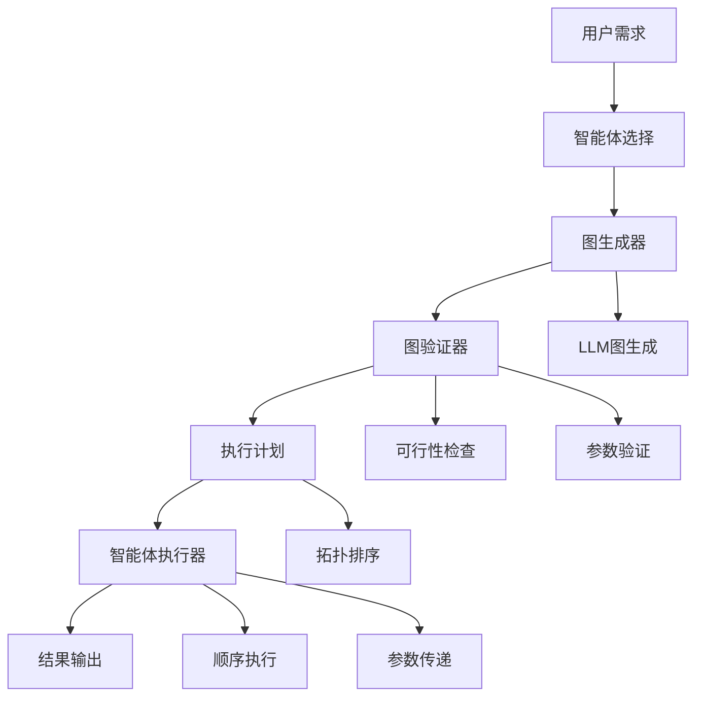

# 05-图驱动工作流

## 概述

图驱动工作流是VideoAgent的核心创新之一，它能够将用户的复杂需求自动转换为可执行的智能体执行图。通过图结构表示任务依赖关系，系统能够智能地规划执行顺序，优化资源使用，并支持复杂的多步骤任务。

## 核心概念

### 执行图 (Execution Graph)
执行图是一个有向无环图(DAG)，其中节点代表智能体，边代表数据流和依赖关系。

### 智能体链 (Agent Chain)
智能体链是执行图的一个拓扑排序，定义了智能体的执行顺序。

### 参数传递 (Parameter Passing)
智能体之间通过参数传递进行数据交换，支持复杂的多步骤处理。

### 工作流验证 (Workflow Validation)
验证执行图的可行性，检查参数类型匹配和执行顺序合理性。

## 系统架构



## 步骤1：图生成器实现

### 1.1 图生成提示词设计

**知识点：**
- 图结构表示方法
- 智能体元数据集成
- 参数连接关系定义

**实现思路：**
1. 设计图生成的提示词模板
2. 包含智能体元数据和用户需求
3. 指定图的输出格式
4. 支持反思和重新生成

**提示词结构：**
```
你是一个智能体图设计师。我将提供用户需求和注册智能体（名称、描述和参数信息）：

你的任务是：
1. 判断可行性：评估用户需求的实现可行性
2. 设计可执行智能体图：包含每个智能体节点的元数据
3. 生成智能体链：基于智能体图生成执行顺序
4. 生成用户输入图：确定需要用户提供的输入参数
5. 输出推理：提供简洁的推理说明

输出格式：
{
    "Feasibility": "Feasible" or "Infeasible",
    "Agent Graph": [...],
    "Agent Chain": [...],
    "User Input Graph": [...],
    "Reasoning": "..."
}
```

**测试方法：**
- 准备不同复杂度的测试用例
- 验证图生成质量
- 测试图结构解析

### 1.2 图结构解析器

**知识点：**
- JSON格式解析
- 图数据结构验证
- 异常处理

**实现思路：**
1. 解析LLM返回的JSON格式
2. 验证图结构的完整性
3. 检查必需字段存在性
4. 处理解析异常

**测试方法：**
- 创建各种格式的测试输入
- 验证解析准确性
- 测试异常情况处理

### 1.3 图生成优化

**知识点：**
- 图生成策略优化
- 智能体组合优化
- 参数传递优化

**实现思路：**
1. 分析用户需求复杂度
2. 选择最优的智能体组合
3. 优化参数传递路径
4. 减少冗余操作

**测试方法：**
- 测试不同复杂度场景
- 验证优化效果
- 检查性能提升

## 步骤2：图验证器实现

### 2.1 可行性检查

**知识点：**
- 需求可行性评估
- 智能体能力匹配
- 资源需求分析

**实现思路：**
1. 分析用户需求的实现难度
2. 检查所需智能体的可用性
3. 评估资源需求
4. 提供可行性建议

**测试方法：**
- 创建可行和不可行的测试用例
- 验证可行性判断准确性
- 测试建议生成质量

### 2.2 参数验证

**知识点：**
- 参数类型检查
- 参数传递验证
- 依赖关系检查

**实现思路：**
1. 检查参数类型匹配
2. 验证参数传递路径
3. 检查依赖关系完整性
4. 识别参数冲突

**测试方法：**
- 创建参数类型匹配测试
- 验证传递路径正确性
- 测试依赖关系检查

### 2.3 执行顺序验证

**知识点：**
- 拓扑排序验证
- 循环依赖检测
- 执行顺序优化

**实现思路：**
1. 验证执行顺序的合理性
2. 检测循环依赖
3. 优化执行顺序
4. 提供执行建议

**测试方法：**
- 创建有循环依赖的测试图
- 验证循环检测准确性
- 测试顺序优化效果

## 步骤3：智能体链生成

### 3.1 拓扑排序算法

**知识点：**
- 图算法实现
- 拓扑排序
- 执行顺序优化

**实现思路：**
1. 实现拓扑排序算法
2. 处理复杂依赖关系
3. 优化执行顺序
4. 支持并行执行识别

**测试方法：**
- 创建复杂依赖图测试
- 验证排序算法正确性
- 测试并行执行识别

### 3.2 执行计划生成

**知识点：**
- 执行计划设计
- 资源分配优化
- 并行执行支持

**实现思路：**
1. 生成详细的执行计划
2. 优化资源分配
3. 识别并行执行机会
4. 提供执行建议

**测试方法：**
- 测试执行计划生成
- 验证资源分配优化
- 检查并行执行识别

## 步骤4：参数传递系统

### 4.1 参数映射管理

**知识点：**
- 参数映射关系
- 数据类型转换
- 参数验证

**实现思路：**
1. 管理参数映射关系
2. 实现数据类型转换
3. 验证参数有效性
4. 处理参数冲突

**测试方法：**
- 测试参数映射准确性
- 验证类型转换正确性
- 检查参数验证功能

### 4.2 上下文管理

**知识点：**
- 执行上下文维护
- 状态管理
- 数据持久化

**实现思路：**
1. 维护执行上下文
2. 管理执行状态
3. 支持数据持久化
4. 提供上下文查询

**测试方法：**
- 测试上下文维护
- 验证状态管理
- 检查数据持久化

## 步骤5：执行器实现

### 5.1 顺序执行器

**知识点：**
- 智能体顺序执行
- 参数传递实现
- 结果收集

**实现思路：**
1. 按顺序执行智能体
2. 实现参数传递
3. 收集执行结果
4. 处理执行异常

**测试方法：**
- 测试顺序执行正确性
- 验证参数传递准确性
- 检查结果收集

### 5.2 并行执行器

**知识点：**
- 并行执行支持
- 资源管理
- 同步机制

**实现思路：**
1. 识别可并行执行的智能体
2. 实现并行执行框架
3. 管理资源分配
4. 处理同步问题

**测试方法：**
- 测试并行执行识别
- 验证并行执行正确性
- 检查资源管理

## 步骤6：反思和优化

### 6.1 执行结果分析

**知识点：**
- 执行结果评估
- 性能分析
- 优化建议生成

**实现思路：**
1. 分析执行结果
2. 评估执行性能
3. 生成优化建议
4. 记录学习经验

**测试方法：**
- 测试结果分析准确性
- 验证性能评估
- 检查优化建议质量

### 6.2 工作流优化

**知识点：**
- 工作流重构
- 智能体组合优化
- 参数传递优化

**实现思路：**
1. 分析工作流效率
2. 重构工作流结构
3. 优化智能体组合
4. 改进参数传递

**测试方法：**
- 测试工作流重构
- 验证优化效果
- 检查性能提升

## 步骤7：错误处理和恢复

### 7.1 异常处理机制

**知识点：**
- 异常捕获和处理
- 错误恢复策略
- 优雅降级

**实现思路：**
1. 捕获执行异常
2. 实现错误恢复
3. 提供降级方案
4. 记录错误信息

**测试方法：**
- 故意触发异常
- 验证错误处理
- 测试恢复机制

### 7.2 断点续传

**知识点：**
- 状态保存和恢复
- 断点续传实现
- 数据一致性保证

**实现思路：**
1. 保存执行状态
2. 实现断点续传
3. 保证数据一致性
4. 提供恢复接口

**测试方法：**
- 测试状态保存
- 验证断点续传
- 检查数据一致性

## 单元测试指南

### 测试文件结构

```
tests/
├── test_graph_generator.py     # 图生成器测试
├── test_graph_validator.py     # 图验证器测试
├── test_agent_chain.py         # 智能体链测试
├── test_parameter_passing.py   # 参数传递测试
├── test_executor.py            # 执行器测试
└── test_optimization.py        # 优化测试
```

### 测试用例设计

**图生成器测试：**
- 简单图生成测试
- 复杂图生成测试
- 图结构验证测试
- 异常情况测试

**图验证器测试：**
- 可行性检查测试
- 参数验证测试
- 执行顺序测试
- 错误检测测试

**智能体链测试：**
- 拓扑排序测试
- 执行计划测试
- 并行执行测试
- 依赖关系测试

**参数传递测试：**
- 参数映射测试
- 类型转换测试
- 上下文管理测试
- 数据一致性测试

### 测试数据准备

**测试用例：**
- 简单任务：单一智能体执行
- 中等任务：2-3个智能体协作
- 复杂任务：5+个智能体协作
- 并行任务：可并行执行的智能体

**测试数据：**
- 模拟智能体元数据
- 测试参数数据
- 模拟执行结果

## 集成测试指南

### 端到端测试

**测试流程：**
1. 准备测试环境和数据
2. 执行完整工作流
3. 验证中间结果
4. 检查最终输出

**测试场景：**
- 音频处理工作流
- 视频编辑工作流
- 语音合成工作流
- 复杂多模态工作流

### 性能测试

**测试指标：**
- 图生成时间
- 验证时间
- 执行时间
- 资源使用率

**测试工具：**
- 性能监控工具
- 压力测试工具
- 资源分析工具

## 部署和运维

### 配置管理

**配置文件：**
- 图生成配置
- 验证规则配置
- 执行器配置
- 优化参数配置

**环境变量：**
- 调试模式设置
- 性能参数配置
- 日志级别设置

### 监控和日志

**监控指标：**
- 图生成成功率
- 验证通过率
- 执行成功率
- 平均执行时间

**日志记录：**
- 图生成日志
- 验证日志
- 执行日志
- 性能日志

## 故障排除

### 常见问题

**1. 图生成失败**
- 检查LLM配置
- 验证智能体元数据
- 调整提示词模板

**2. 图验证失败**
- 检查参数类型匹配
- 验证依赖关系
- 调整验证规则

**3. 执行失败**
- 检查智能体实现
- 验证参数传递
- 查看错误日志

**4. 性能问题**
- 启用并行执行
- 优化图结构
- 调整资源分配

### 调试技巧

**调试工具：**
- 图可视化工具
- 执行轨迹分析
- 性能分析工具

**调试方法：**
- 添加详细日志
- 使用调试模式
- 分析执行轨迹

## 下一步

完成图驱动工作流复现后，请继续阅读：
- [06-语音合成工具集成](./06-tts-integration.md)
- [07-视频处理工具集成](./07-video-processing.md)

## 知识点总结

1. **图算法**：拓扑排序、循环检测等图算法应用
2. **工作流设计**：复杂任务的工作流建模和优化
3. **参数传递**：智能体间的数据传递和类型转换
4. **并行执行**：识别和实现并行执行机会
5. **错误处理**：完善的异常处理和恢复机制

通过系统性地复现图驱动工作流，您将掌握现代AI系统中任务编排和执行的核心理念。
