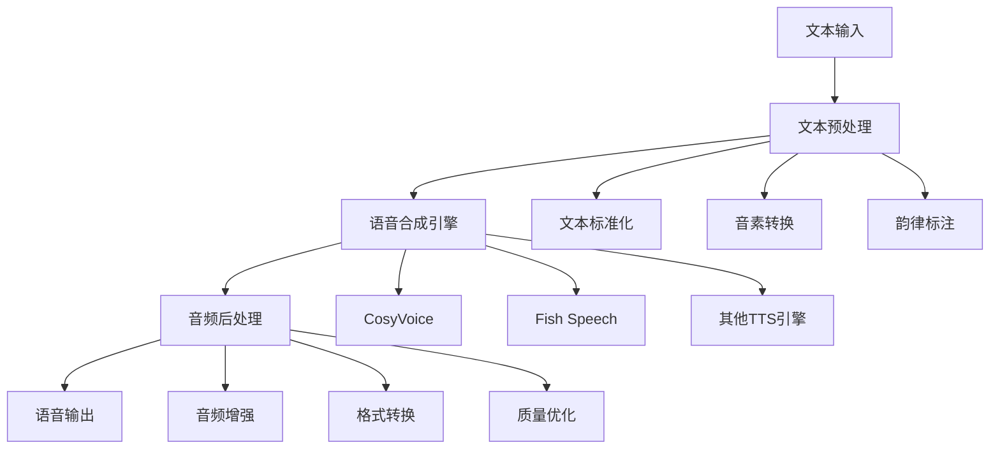

# 06-语音合成工具集成

## 概述

语音合成工具集成是VideoAgent的重要组成部分，负责将文本转换为高质量的语音。本系统集成了多种先进的语音合成技术，包括CosyVoice、Fish Speech等，支持多种语言和音色，能够满足不同场景的语音合成需求。

## 核心概念

### 语音合成 (Text-to-Speech, TTS)
将文本转换为自然语音的技术，包括语音模型训练、推理和优化。

### 音色克隆 (Voice Cloning)
基于少量样本音频，生成具有特定音色的语音合成模型。

### 多语言支持 (Multilingual Support)
支持多种语言的语音合成，包括中文、英文等。

### 实时合成 (Real-time Synthesis)
支持实时或准实时的语音合成，满足交互式应用需求。

## 系统架构



## 步骤1：CosyVoice集成

### 1.1 CosyVoice模型下载和配置

**知识点：**
- Hugging Face模型管理
- 模型文件结构理解
- 配置参数优化

**实现思路：**
1. 下载CosyVoice预训练模型
2. 配置模型路径和参数
3. 验证模型加载正确性
4. 优化模型配置

**模型下载：**
```bash
cd tools/CosyVoice
huggingface-cli download PillowTa1k/CosyVoice --local-dir pretrained_models
```

**测试方法：**
- 验证模型文件完整性
- 测试模型加载速度
- 检查内存使用情况

### 1.2 CosyVoice智能体实现

**知识点：**
- 智能体接口实现
- 参数验证和类型检查
- 错误处理和异常管理

**实现思路：**
1. 创建CosyVoice智能体类
2. 实现输入输出模式定义
3. 封装CosyVoice API调用
4. 实现参数验证和错误处理

**智能体结构：**
- 输入：文本内容、音色参数、输出格式
- 输出：生成的语音文件路径
- 功能：文本到语音转换

**测试方法：**
- 创建单元测试用例
- 验证参数验证功能
- 测试API调用正确性

### 1.3 音色管理

**知识点：**
- 音色库管理
- 音色选择策略
- 音色质量评估

**实现思路：**
1. 管理可用音色库
2. 实现音色选择逻辑
3. 提供音色质量评估
4. 支持自定义音色

**测试方法：**
- 测试音色库加载
- 验证音色选择逻辑
- 检查音色质量评估

## 步骤2：Fish Speech集成

### 2.1 Fish Speech模型配置

**知识点：**
- Fish Speech架构理解
- 模型参数调优
- 性能优化

**实现思路：**
1. 下载Fish Speech模型
2. 配置模型参数
3. 优化推理性能
4. 实现模型管理

**模型下载：**
```bash
cd tools/fish-speech
huggingface-cli download fishaudio/fish-speech-1.5 --local-dir checkpoints/fish-speech-1.5
```

**测试方法：**
- 验证模型配置正确性
- 测试推理性能
- 检查输出质量

### 2.2 Fish Speech智能体实现

**知识点：**
- Fish Speech API封装
- 参数映射和转换
- 结果处理

**实现思路：**
1. 封装Fish Speech接口
2. 实现参数映射
3. 处理合成结果
4. 提供统一接口

**测试方法：**
- 测试API封装功能
- 验证参数映射
- 检查结果处理

### 2.3 多语言支持

**知识点：**
- 多语言模型管理
- 语言检测和切换
- 跨语言合成

**实现思路：**
1. 管理多语言模型
2. 实现语言检测
3. 支持语言切换
4. 优化跨语言合成

**测试方法：**
- 测试多语言模型加载
- 验证语言检测准确性
- 检查跨语言合成质量

## 步骤3：TTS智能体系统

### 3.1 TTSWriter智能体

**知识点：**
- 文本预处理
- 合成参数管理
- 结果输出

**实现思路：**
1. 实现文本预处理
2. 管理合成参数
3. 调用TTS引擎
4. 处理输出结果

**功能特点：**
- 支持多种文本格式
- 可配置合成参数
- 提供质量评估

**测试方法：**
- 测试文本预处理
- 验证参数管理
- 检查输出质量

### 3.2 TTSInfer智能体

**知识点：**
- 推理引擎管理
- 批量处理支持
- 性能优化

**实现思路：**
1. 管理推理引擎
2. 实现批量处理
3. 优化推理性能
4. 提供进度反馈

**测试方法：**
- 测试推理引擎管理
- 验证批量处理
- 检查性能优化

### 3.3 TTSReplace智能体

**知识点：**
- 语音替换技术
- 时间对齐
- 质量保持

**实现思路：**
1. 实现语音替换
2. 保持时间对齐
3. 维持音质质量
4. 提供替换选项

**测试方法：**
- 测试语音替换功能
- 验证时间对齐
- 检查质量保持

## 步骤4：音频处理集成

### 4.1 音频预处理

**知识点：**
- 音频格式转换
- 采样率调整
- 音频增强

**实现思路：**
1. 实现格式转换
2. 调整采样率
3. 应用音频增强
4. 优化处理流程

**测试方法：**
- 测试格式转换
- 验证采样率调整
- 检查音频增强效果

### 4.2 音频后处理

**知识点：**
- 音频质量优化
- 噪声抑制
- 音量标准化

**实现思路：**
1. 优化音频质量
2. 抑制背景噪声
3. 标准化音量
4. 应用音频效果

**测试方法：**
- 测试质量优化
- 验证噪声抑制
- 检查音量标准化

### 4.3 音频切片

**知识点：**
- 音频分段处理
- 切片策略
- 质量保证

**实现思路：**
1. 实现音频分段
2. 优化切片策略
3. 保证切片质量
4. 支持并行处理

**测试方法：**
- 测试音频分段
- 验证切片策略
- 检查质量保证

## 步骤5：质量控制和优化

### 5.1 合成质量评估

**知识点：**
- 质量评估指标
- 自动质量检测
- 质量改进建议

**实现思路：**
1. 定义质量指标
2. 实现自动检测
3. 生成改进建议
4. 提供质量报告

**测试方法：**
- 测试质量评估
- 验证自动检测
- 检查改进建议

### 5.2 性能优化

**知识点：**
- 推理速度优化
- 内存使用优化
- 并发处理优化

**实现思路：**
1. 优化推理速度
2. 减少内存使用
3. 实现并发处理
4. 提供性能监控

**测试方法：**
- 测试速度优化
- 验证内存优化
- 检查并发处理

### 5.3 缓存机制

**知识点：**
- 合成结果缓存
- 缓存策略设计
- 缓存管理

**实现思路：**
1. 实现结果缓存
2. 设计缓存策略
3. 管理缓存空间
4. 提供缓存统计

**测试方法：**
- 测试缓存功能
- 验证缓存策略
- 检查缓存管理

## 步骤6：高级功能

### 6.1 音色克隆

**知识点：**
- 音色特征提取
- 模型微调
- 克隆质量评估

**实现思路：**
1. 提取音色特征
2. 实现模型微调
3. 评估克隆质量
4. 提供克隆服务

**测试方法：**
- 测试特征提取
- 验证模型微调
- 检查克隆质量

### 6.2 情感语音合成

**知识点：**
- 情感识别
- 情感语音生成
- 情感控制

**实现思路：**
1. 识别文本情感
2. 生成情感语音
3. 控制情感强度
4. 提供情感选项

**测试方法：**
- 测试情感识别
- 验证情感生成
- 检查情感控制

### 6.3 实时合成

**知识点：**
- 流式处理
- 低延迟优化
- 实时质量控制

**实现思路：**
1. 实现流式处理
2. 优化延迟
3. 控制实时质量
4. 提供实时接口

**测试方法：**
- 测试流式处理
- 验证延迟优化
- 检查质量控制

## 单元测试指南

### 测试文件结构

```
tests/
├── test_cosyvoice.py          # CosyVoice测试
├── test_fish_speech.py        # Fish Speech测试
├── test_tts_agents.py         # TTS智能体测试
├── test_audio_processing.py   # 音频处理测试
├── test_quality_control.py    # 质量控制测试
└── test_advanced_features.py  # 高级功能测试
```

### 测试用例设计

**CosyVoice测试：**
- 模型加载测试
- 合成质量测试
- 参数配置测试
- 性能测试

**Fish Speech测试：**
- 模型配置测试
- 多语言测试
- 推理性能测试
- 质量评估测试

**TTS智能体测试：**
- 接口实现测试
- 参数验证测试
- 错误处理测试
- 集成测试

**音频处理测试：**
- 预处理测试
- 后处理测试
- 格式转换测试
- 质量优化测试

### 测试数据准备

**测试用例：**
- 简单文本："Hello, world!"
- 复杂文本：包含标点符号的长文本
- 多语言文本：中英文混合文本
- 特殊字符：包含数字、符号的文本

**测试数据：**
- 各种格式的音频文件
- 不同质量的参考音频
- 测试用的音色样本

## 集成测试指南

### 端到端测试

**测试流程：**
1. 准备测试文本和参数
2. 执行语音合成流程
3. 验证输出质量
4. 检查性能指标

**测试场景：**
- 基础语音合成
- 多语言合成
- 音色克隆
- 实时合成

### 性能测试

**测试指标：**
- 合成速度
- 内存使用
- 输出质量
- 并发处理能力

**测试工具：**
- 性能监控工具
- 质量评估工具
- 压力测试工具

## 部署和运维

### 配置管理

**配置文件：**
- 模型路径配置
- 合成参数配置
- 质量参数配置
- 性能参数配置

**环境变量：**
- 模型路径设置
- 缓存目录配置
- 调试模式设置

### 监控和日志

**监控指标：**
- 合成成功率
- 平均合成时间
- 质量评分
- 资源使用率

**日志记录：**
- 合成过程日志
- 质量评估日志
- 性能日志
- 错误日志

## 故障排除

### 常见问题

**1. 模型加载失败**
- 检查模型文件完整性
- 验证模型路径配置
- 检查内存使用情况

**2. 合成质量差**
- 调整合成参数
- 检查输入文本质量
- 优化模型配置

**3. 性能问题**
- 启用GPU加速
- 优化批处理大小
- 调整并发数量

**4. 内存不足**
- 减少批处理大小
- 启用模型量化
- 优化缓存策略

### 调试技巧

**调试工具：**
- 模型分析工具
- 性能分析工具
- 质量评估工具

**调试方法：**
- 添加详细日志
- 使用调试模式
- 分析性能瓶颈

## 下一步

完成语音合成工具集成后，请继续阅读：
- [07-视频处理工具集成](./07-video-processing.md)
- [08-音频处理工具集成](./08-audio-processing.md)

## 知识点总结

1. **模型集成**：多种TTS模型的集成和管理
2. **智能体设计**：TTS功能的智能体化封装
3. **质量控制**：合成质量的评估和优化
4. **性能优化**：推理速度和资源使用优化
5. **高级功能**：音色克隆、情感合成等高级特性

通过系统性地集成语音合成工具，您将掌握现代AI系统中语音技术的核心应用。
