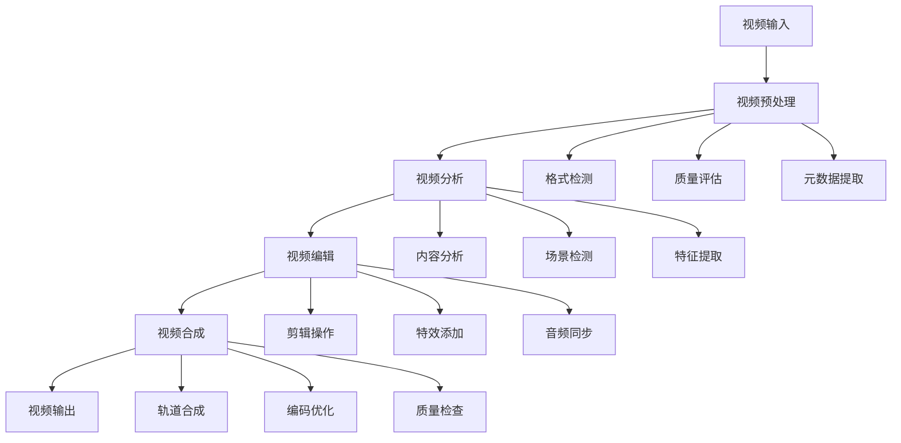

# 07-视频处理工具集成

## 概述

视频处理工具集成是VideoAgent的核心功能之一，负责视频的编辑、合成、格式转换等操作。本系统集成了多种视频处理技术，支持复杂的视频编辑任务，能够实现自动化视频制作和优化。

## 核心概念

### 视频编辑 (Video Editing)
对视频进行剪辑、合成、特效添加等操作，包括时间轴管理、轨道合成等。

### 视频格式转换 (Video Format Conversion)
在不同视频格式之间进行转换，优化文件大小和质量。

### 视频搜索 (Video Search)
基于内容特征搜索相关视频片段，支持语义搜索和相似度匹配。

### 视频预加载 (Video Preloading)
预先加载和处理视频文件，优化后续处理性能。

## 系统架构



## 步骤1：视频预加载系统

### 1.1 VideoPreloader智能体

**知识点：**
- 视频文件管理
- 预加载策略
- 内存优化

**实现思路：**
1. 实现视频文件扫描和索引
2. 设计预加载策略
3. 优化内存使用
4. 提供视频元数据

**功能特点：**
- 支持多种视频格式
- 智能预加载策略
- 内存使用优化
- 元数据提取

**测试方法：**
- 测试视频文件扫描
- 验证预加载策略
- 检查内存使用优化

### 1.2 视频元数据管理

**知识点：**
- 元数据提取
- 数据库设计
- 查询优化

**实现思路：**
1. 提取视频元数据
2. 设计元数据存储
3. 实现快速查询
4. 支持元数据更新

**元数据包括：**
- 基本信息：时长、分辨率、帧率
- 内容信息：场景、对象、动作
- 技术信息：编码格式、比特率
- 质量信息：清晰度、稳定性

**测试方法：**
- 测试元数据提取
- 验证存储效率
- 检查查询性能

### 1.3 视频索引系统

**知识点：**
- 索引结构设计
- 快速检索算法
- 相似度计算

**实现思路：**
1. 设计视频索引结构
2. 实现快速检索
3. 计算相似度
4. 优化检索性能

**测试方法：**
- 测试索引构建
- 验证检索准确性
- 检查相似度计算

## 步骤2：视频搜索系统

### 2.1 VideoSearcher智能体

**知识点：**
- 语义搜索
- 特征匹配
- 排序算法

**实现思路：**
1. 实现语义搜索
2. 进行特征匹配
3. 应用排序算法
4. 提供搜索结果

**搜索类型：**
- 文本搜索：基于描述文本
- 视觉搜索：基于视觉特征
- 音频搜索：基于音频特征
- 混合搜索：多模态搜索

**测试方法：**
- 测试搜索准确性
- 验证排序效果
- 检查搜索性能

### 2.2 多模态搜索

**知识点：**
- 多模态特征融合
- 跨模态检索
- 相似度计算

**实现思路：**
1. 融合多模态特征
2. 实现跨模态检索
3. 计算相似度
4. 优化检索效果

**测试方法：**
- 测试特征融合
- 验证跨模态检索
- 检查相似度计算

### 2.3 搜索优化

**知识点：**
- 搜索算法优化
- 缓存机制
- 性能调优

**实现思路：**
1. 优化搜索算法
2. 实现结果缓存
3. 调优性能参数
4. 提供搜索统计

**测试方法：**
- 测试算法优化
- 验证缓存效果
- 检查性能提升

## 步骤3：视频编辑系统

### 3.1 VideoEditor智能体

**知识点：**
- 视频剪辑操作
- 时间轴管理
- 轨道合成

**实现思路：**
1. 实现视频剪辑功能
2. 管理时间轴
3. 处理多轨道合成
4. 提供编辑接口

**编辑功能：**
- 剪切和拼接
- 特效添加
- 转场效果
- 音频同步

**测试方法：**
- 测试剪辑功能
- 验证时间轴管理
- 检查轨道合成

### 3.2 视频特效系统

**知识点：**
- 特效算法实现
- 实时渲染
- 效果预览

**实现思路：**
1. 实现各种特效算法
2. 支持实时渲染
3. 提供效果预览
4. 优化渲染性能

**特效类型：**
- 基础特效：缩放、旋转、移动
- 高级特效：滤镜、调色、美颜
- 转场特效：淡入淡出、滑动、翻转
- 文字特效：字幕、标题、水印

**测试方法：**
- 测试特效算法
- 验证实时渲染
- 检查效果预览

### 3.3 音频视频同步

**知识点：**
- 同步算法
- 时间对齐
- 质量保证

**实现思路：**
1. 实现同步算法
2. 进行时间对齐
3. 保证同步质量
4. 处理同步异常

**测试方法：**
- 测试同步算法
- 验证时间对齐
- 检查质量保证

## 步骤4：视频格式转换

### 4.1 VideoConversion智能体

**知识点：**
- 格式转换算法
- 编码优化
- 质量保持

**实现思路：**
1. 实现格式转换
2. 优化编码参数
3. 保持转换质量
4. 提供转换选项

**转换功能：**
- 格式转换：MP4、AVI、MOV等
- 分辨率调整：4K、1080p、720p等
- 编码优化：H.264、H.265等
- 质量设置：高、中、低质量

**测试方法：**
- 测试格式转换
- 验证编码优化
- 检查质量保持

### 4.2 批量转换

**知识点：**
- 批量处理
- 进度管理
- 错误处理

**实现思路：**
1. 实现批量处理
2. 管理处理进度
3. 处理转换错误
4. 提供进度反馈

**测试方法：**
- 测试批量处理
- 验证进度管理
- 检查错误处理

### 4.3 转换优化

**知识点：**
- 转换速度优化
- 质量优化
- 资源管理

**实现思路：**
1. 优化转换速度
2. 提升转换质量
3. 管理资源使用
4. 提供优化建议

**测试方法：**
- 测试速度优化
- 验证质量提升
- 检查资源管理

## 步骤5：视频质量优化

### 5.1 质量评估

**知识点：**
- 质量评估指标
- 自动质量检测
- 质量报告生成

**实现思路：**
1. 定义质量指标
2. 实现自动检测
3. 生成质量报告
4. 提供改进建议

**质量指标：**
- 技术指标：分辨率、帧率、比特率
- 视觉指标：清晰度、对比度、色彩
- 音频指标：音量、音质、同步
- 整体指标：流畅度、稳定性

**测试方法：**
- 测试质量评估
- 验证自动检测
- 检查报告生成

### 5.2 质量增强

**知识点：**
- 图像增强算法
- 噪声抑制
- 锐化处理

**实现思路：**
1. 实现图像增强
2. 抑制视频噪声
3. 应用锐化处理
4. 优化增强效果

**测试方法：**
- 测试图像增强
- 验证噪声抑制
- 检查锐化效果

### 5.3 质量监控

**知识点：**
- 实时质量监控
- 质量趋势分析
- 异常检测

**实现思路：**
1. 实现实时监控
2. 分析质量趋势
3. 检测质量异常
4. 提供监控报告

**测试方法：**
- 测试实时监控
- 验证趋势分析
- 检查异常检测

## 步骤6：高级功能

### 6.1 智能剪辑

**知识点：**
- AI辅助剪辑
- 场景自动识别
- 剪辑建议生成

**实现思路：**
1. 实现AI辅助剪辑
2. 自动识别场景
3. 生成剪辑建议
4. 提供智能推荐

**测试方法：**
- 测试AI辅助功能
- 验证场景识别
- 检查建议质量

### 6.2 自动字幕生成

**知识点：**
- 语音识别
- 字幕同步
- 多语言支持

**实现思路：**
1. 实现语音识别
2. 进行字幕同步
3. 支持多语言
4. 优化字幕质量

**测试方法：**
- 测试语音识别
- 验证字幕同步
- 检查多语言支持

### 6.3 视频摘要生成

**知识点：**
- 关键帧提取
- 内容摘要
- 摘要优化

**实现思路：**
1. 提取关键帧
2. 生成内容摘要
3. 优化摘要质量
4. 提供摘要选项

**测试方法：**
- 测试关键帧提取
- 验证摘要生成
- 检查摘要质量

## 单元测试指南

### 测试文件结构

```
tests/
├── test_video_preloader.py    # 视频预加载测试
├── test_video_searcher.py     # 视频搜索测试
├── test_video_editor.py       # 视频编辑测试
├── test_video_conversion.py    # 视频转换测试
├── test_quality_optimization.py # 质量优化测试
└── test_advanced_features.py  # 高级功能测试
```

### 测试用例设计

**视频预加载测试：**
- 文件扫描测试
- 预加载策略测试
- 元数据提取测试
- 内存使用测试

**视频搜索测试：**
- 搜索准确性测试
- 排序效果测试
- 多模态搜索测试
- 性能测试

**视频编辑测试：**
- 剪辑功能测试
- 特效系统测试
- 同步功能测试
- 集成测试

**视频转换测试：**
- 格式转换测试
- 批量处理测试
- 质量保持测试
- 性能测试

### 测试数据准备

**测试用例：**
- 不同格式的视频文件
- 不同质量的视频样本
- 不同长度的视频片段
- 包含各种内容的视频

**测试数据：**
- 标准测试视频
- 边界情况视频
- 异常格式视频
- 性能测试视频

## 集成测试指南

### 端到端测试

**测试流程：**
1. 准备测试视频和参数
2. 执行完整处理流程
3. 验证中间结果
4. 检查最终输出

**测试场景：**
- 视频编辑工作流
- 格式转换工作流
- 质量优化工作流
- 智能剪辑工作流

### 性能测试

**测试指标：**
- 处理速度
- 内存使用
- 输出质量
- 并发处理能力

**测试工具：**
- 性能监控工具
- 质量评估工具
- 压力测试工具

## 部署和运维

### 配置管理

**配置文件：**
- 视频处理参数配置
- 质量参数配置
- 性能参数配置
- 缓存配置

**环境变量：**
- 视频处理路径
- 缓存目录配置
- 调试模式设置

### 监控和日志

**监控指标：**
- 处理成功率
- 平均处理时间
- 质量评分
- 资源使用率

**日志记录：**
- 处理过程日志
- 质量评估日志
- 性能日志
- 错误日志

## 故障排除

### 常见问题

**1. 视频加载失败**
- 检查文件格式支持
- 验证文件完整性
- 检查内存使用情况

**2. 处理速度慢**
- 启用GPU加速
- 优化处理参数
- 调整并发数量

**3. 输出质量差**
- 调整质量参数
- 检查输入质量
- 优化处理算法

**4. 内存不足**
- 减少批处理大小
- 优化内存使用
- 启用流式处理

### 调试技巧

**调试工具：**
- 视频分析工具
- 性能分析工具
- 质量评估工具

**调试方法：**
- 添加详细日志
- 使用调试模式
- 分析处理轨迹

## 下一步

完成视频处理工具集成后，请继续阅读：
- [08-音频处理工具集成](./08-audio-processing.md)
- [09-单元测试指南](./09-unit-testing.md)

## 知识点总结

1. **视频处理**：视频编辑、转换、优化等核心功能
2. **智能搜索**：基于内容的视频搜索和匹配
3. **质量优化**：视频质量的评估和增强
4. **性能优化**：处理速度和资源使用优化
5. **高级功能**：AI辅助剪辑、自动字幕等智能功能

通过系统性地集成视频处理工具，您将掌握现代AI系统中视频技术的核心应用。
