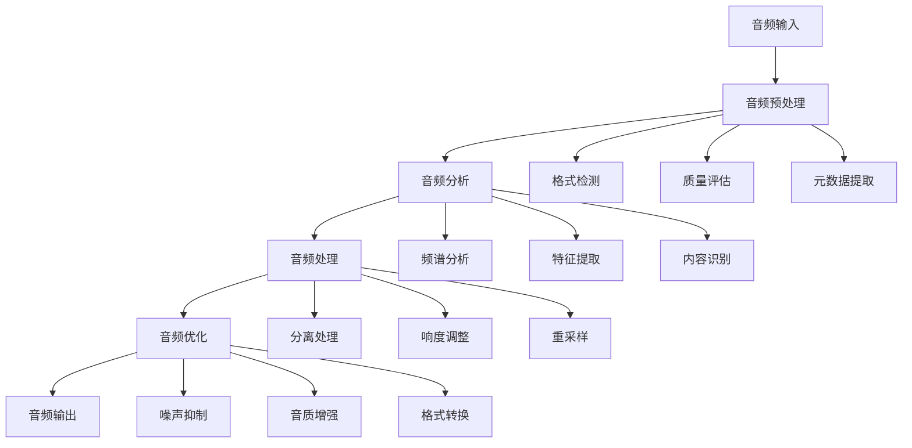

# 08-音频处理工具集成

## 概述

音频处理工具集成是VideoAgent的重要组成部分，负责音频的提取、处理、优化和合成。本系统集成了多种音频处理技术，包括音频分离、响度标准化、重采样等，能够满足复杂的音频处理需求。

## 核心概念

### 音频提取 (Audio Extraction)
从视频文件中提取音频轨道，支持多种音频格式和编码。

### 音频分离 (Audio Separation)
将混合音频分离为不同的音轨，如人声、背景音乐、音效等。

### 响度标准化 (Loudness Normalization)
统一音频的响度水平，确保音频播放的一致性。

### 音频重采样 (Audio Resampling)
调整音频的采样率，适应不同的播放设备和处理需求。

## 系统架构



## 步骤1：音频提取系统

### 1.1 AudioExtractor智能体

**知识点：**
- 音频提取算法
- 格式支持
- 质量保证

**实现思路：**
1. 实现音频提取功能
2. 支持多种音频格式
3. 保证提取质量
4. 提供提取选项

**功能特点：**
- 支持多种视频格式
- 保持音频质量
- 快速提取速度
- 元数据保留

**测试方法：**
- 测试不同格式的音频提取
- 验证提取质量
- 检查提取速度

### 1.2 音频格式支持

**知识点：**
- 音频编码格式
- 格式转换
- 兼容性处理

**实现思路：**
1. 支持主流音频格式
2. 实现格式转换
3. 处理兼容性问题
4. 优化格式选择

**支持格式：**
- 无损格式：WAV、FLAC、ALAC
- 有损格式：MP3、AAC、OGG
- 专业格式：AIFF、WMA
- 压缩格式：M4A、3GP

**测试方法：**
- 测试格式支持
- 验证转换质量
- 检查兼容性

### 1.3 音频元数据管理

**知识点：**
- 元数据提取
- 标签管理
- 信息保留

**实现思路：**
1. 提取音频元数据
2. 管理标签信息
3. 保留重要信息
4. 提供元数据查询

**元数据包括：**
- 基本信息：时长、采样率、比特率
- 技术信息：编码格式、声道数
- 标签信息：标题、艺术家、专辑
- 质量信息：动态范围、频率响应

**测试方法：**
- 测试元数据提取
- 验证标签管理
- 检查信息保留

## 步骤2：音频分离系统

### 2.1 Separator智能体

**知识点：**
- 音频分离算法
- 深度学习模型
- 分离质量评估

**实现思路：**
1. 实现音频分离功能
2. 集成分离模型
3. 评估分离质量
4. 优化分离效果

**分离类型：**
- 人声分离：提取人声轨道
- 背景音乐分离：提取背景音乐
- 音效分离：提取音效轨道
- 多轨道分离：同时分离多个音轨

**测试方法：**
- 测试分离算法
- 验证分离质量
- 检查模型性能

### 2.2 分离模型集成

**知识点：**
- 模型选择
- 模型优化
- 性能调优

**实现思路：**
1. 选择合适的分离模型
2. 优化模型参数
3. 调优分离性能
4. 提供模型选择

**模型类型：**
- 传统算法：基于信号处理
- 机器学习：基于特征学习
- 深度学习：基于神经网络
- 混合方法：结合多种技术

**测试方法：**
- 测试模型选择
- 验证模型优化
- 检查性能调优

### 2.3 分离质量评估

**知识点：**
- 质量评估指标
- 自动质量检测
- 质量改进建议

**实现思路：**
1. 定义质量指标
2. 实现自动检测
3. 生成改进建议
4. 提供质量报告

**质量指标：**
- 分离纯度：各音轨的纯净度
- 信号保持：原始信号的保持度
- 噪声水平：分离后的噪声水平
- 整体质量：综合质量评分

**测试方法：**
- 测试质量评估
- 验证自动检测
- 检查改进建议

## 步骤3：响度标准化系统

### 3.1 LoudnessNormalizer智能体

**知识点：**
- 响度测量
- 标准化算法
- 响度控制

**实现思路：**
1. 实现响度测量
2. 应用标准化算法
3. 控制响度水平
4. 提供标准化选项

**标准化方法：**
- RMS标准化：基于均方根值
- LUFS标准化：基于响度单位
- 峰值标准化：基于峰值电平
- 动态范围标准化：保持动态范围

**测试方法：**
- 测试响度测量
- 验证标准化算法
- 检查响度控制

### 3.2 响度分析

**知识点：**
- 响度分析算法
- 频谱分析
- 动态范围分析

**实现思路：**
1. 实现响度分析
2. 进行频谱分析
3. 分析动态范围
4. 提供分析报告

**分析内容：**
- 整体响度：音频的整体响度水平
- 频谱分布：各频率的响度分布
- 动态范围：响度的变化范围
- 峰值分析：响度的峰值特征

**测试方法：**
- 测试响度分析
- 验证频谱分析
- 检查动态范围分析

### 3.3 响度优化

**知识点：**
- 响度优化算法
- 压缩处理
- 限制处理

**实现思路：**
1. 实现响度优化
2. 应用压缩处理
3. 进行限制处理
4. 优化响度效果

**优化技术：**
- 动态压缩：控制动态范围
- 限制处理：防止过载
- 均衡处理：调整频率响应
- 立体声处理：优化立体声效果

**测试方法：**
- 测试响度优化
- 验证压缩处理
- 检查限制处理

## 步骤4：音频重采样系统

### 4.1 Resampler智能体

**知识点：**
- 重采样算法
- 采样率转换
- 质量保持

**实现思路：**
1. 实现重采样功能
2. 支持采样率转换
3. 保持重采样质量
4. 提供重采样选项

**重采样方法：**
- 线性插值：简单快速
- 三次样条插值：质量较高
- 窗函数插值：减少混叠
- 多相滤波：专业级质量

**测试方法：**
- 测试重采样算法
- 验证采样率转换
- 检查质量保持

### 4.2 采样率优化

**知识点：**
- 采样率选择
- 质量优化
- 性能平衡

**实现思路：**
1. 选择合适的采样率
2. 优化重采样质量
3. 平衡质量和性能
4. 提供采样率建议

**采样率选择：**
- 低质量：22.05kHz、32kHz
- 标准质量：44.1kHz、48kHz
- 高质量：96kHz、192kHz
- 专业质量：384kHz、768kHz

**测试方法：**
- 测试采样率选择
- 验证质量优化
- 检查性能平衡

### 4.3 重采样质量控制

**知识点：**
- 质量评估
- 混叠检测
- 失真控制

**实现思路：**
1. 评估重采样质量
2. 检测混叠现象
3. 控制失真程度
4. 提供质量报告

**质量控制：**
- 混叠检测：检测频率混叠
- 失真测量：测量谐波失真
- 噪声分析：分析噪声水平
- 整体质量：综合质量评估

**测试方法：**
- 测试质量评估
- 验证混叠检测
- 检查失真控制

## 步骤5：音频混合系统

### 5.1 Mixer智能体

**知识点：**
- 音频混合算法
- 音量平衡
- 相位处理

**实现思路：**
1. 实现音频混合功能
2. 平衡各音轨音量
3. 处理相位问题
4. 提供混合选项

**混合功能：**
- 多轨混合：混合多个音轨
- 音量平衡：平衡各轨音量
- 相位对齐：处理相位问题
- 立体声处理：优化立体声效果

**测试方法：**
- 测试混合算法
- 验证音量平衡
- 检查相位处理

### 5.2 混合质量控制

**知识点：**
- 混合质量评估
- 失真检测
- 动态范围控制

**实现思路：**
1. 评估混合质量
2. 检测混合失真
3. 控制动态范围
4. 提供质量报告

**质量控制：**
- 失真检测：检测混合失真
- 动态范围：控制动态范围
- 频率响应：优化频率响应
- 立体声效果：优化立体声效果

**测试方法：**
- 测试质量评估
- 验证失真检测
- 检查动态范围控制

### 5.3 实时混合

**知识点：**
- 实时处理
- 低延迟优化
- 流式处理

**实现思路：**
1. 实现实时混合
2. 优化处理延迟
3. 支持流式处理
4. 提供实时接口

**测试方法：**
- 测试实时混合
- 验证延迟优化
- 检查流式处理

## 步骤6：音频质量优化

### 6.1 噪声抑制

**知识点：**
- 噪声检测算法
- 抑制算法
- 质量保持

**实现思路：**
1. 检测音频噪声
2. 应用抑制算法
3. 保持音频质量
4. 提供抑制选项

**抑制方法：**
- 频谱减法：基于频谱分析
- 维纳滤波：基于统计方法
- 深度学习：基于神经网络
- 自适应滤波：基于信号特性

**测试方法：**
- 测试噪声检测
- 验证抑制算法
- 检查质量保持

### 6.2 音质增强

**知识点：**
- 音质增强算法
- 频率响应优化
- 动态范围扩展

**实现思路：**
1. 实现音质增强
2. 优化频率响应
3. 扩展动态范围
4. 提供增强选项

**增强技术：**
- 频率均衡：调整频率响应
- 动态扩展：扩展动态范围
- 谐波增强：增强谐波成分
- 空间处理：优化空间效果

**测试方法：**
- 测试音质增强
- 验证频率优化
- 检查动态范围扩展

### 6.3 音频修复

**知识点：**
- 音频修复算法
- 损坏检测
- 修复质量评估

**实现思路：**
1. 检测音频损坏
2. 应用修复算法
3. 评估修复质量
4. 提供修复选项

**修复类型：**
- 削波修复：修复削波失真
- 噪声修复：修复噪声干扰
- 断点修复：修复音频断点
- 频率修复：修复频率缺失

**测试方法：**
- 测试损坏检测
- 验证修复算法
- 检查修复质量

## 单元测试指南

### 测试文件结构

```
tests/
├── test_audio_extractor.py     # 音频提取测试
├── test_separator.py           # 音频分离测试
├── test_loudness_normalizer.py # 响度标准化测试
├── test_resampler.py           # 重采样测试
├── test_mixer.py               # 音频混合测试
├── test_quality_optimization.py # 质量优化测试
└── test_audio_repair.py        # 音频修复测试
```

### 测试用例设计

**音频提取测试：**
- 格式支持测试
- 提取质量测试
- 元数据保留测试
- 性能测试

**音频分离测试：**
- 分离算法测试
- 分离质量测试
- 模型性能测试
- 集成测试

**响度标准化测试：**
- 响度测量测试
- 标准化算法测试
- 响度控制测试
- 质量测试

**重采样测试：**
- 重采样算法测试
- 采样率转换测试
- 质量保持测试
- 性能测试

### 测试数据准备

**测试用例：**
- 不同格式的音频文件
- 不同质量的音频样本
- 不同长度的音频片段
- 包含各种内容的音频

**测试数据：**
- 标准测试音频
- 边界情况音频
- 异常格式音频
- 性能测试音频

## 集成测试指南

### 端到端测试

**测试流程：**
1. 准备测试音频和参数
2. 执行完整处理流程
3. 验证中间结果
4. 检查最终输出

**测试场景：**
- 音频提取工作流
- 音频分离工作流
- 响度标准化工作流
- 音频混合工作流

### 性能测试

**测试指标：**
- 处理速度
- 内存使用
- 输出质量
- 并发处理能力

**测试工具：**
- 性能监控工具
- 质量评估工具
- 压力测试工具

## 部署和运维

### 配置管理

**配置文件：**
- 音频处理参数配置
- 质量参数配置
- 性能参数配置
- 模型配置

**环境变量：**
- 音频处理路径
- 模型路径配置
- 调试模式设置

### 监控和日志

**监控指标：**
- 处理成功率
- 平均处理时间
- 质量评分
- 资源使用率

**日志记录：**
- 处理过程日志
- 质量评估日志
- 性能日志
- 错误日志

## 故障排除

### 常见问题

**1. 音频提取失败**
- 检查文件格式支持
- 验证文件完整性
- 检查内存使用情况

**2. 分离质量差**
- 调整分离参数
- 检查输入质量
- 优化分离模型

**3. 处理速度慢**
- 启用GPU加速
- 优化处理参数
- 调整并发数量

**4. 内存不足**
- 减少批处理大小
- 优化内存使用
- 启用流式处理

### 调试技巧

**调试工具：**
- 音频分析工具
- 性能分析工具
- 质量评估工具

**调试方法：**
- 添加详细日志
- 使用调试模式
- 分析处理轨迹

## 下一步

完成音频处理工具集成后，请继续阅读：
- [09-单元测试指南](./09-unit-testing.md)
- [10-集成测试指南](./10-integration-testing.md)

## 知识点总结

1. **音频处理**：音频提取、分离、标准化等核心功能
2. **质量控制**：音频质量的评估和优化
3. **格式支持**：多种音频格式的支持和转换
4. **性能优化**：处理速度和资源使用优化
5. **高级功能**：噪声抑制、音质增强等高级特性

通过系统性地集成音频处理工具，您将掌握现代AI系统中音频技术的核心应用。


