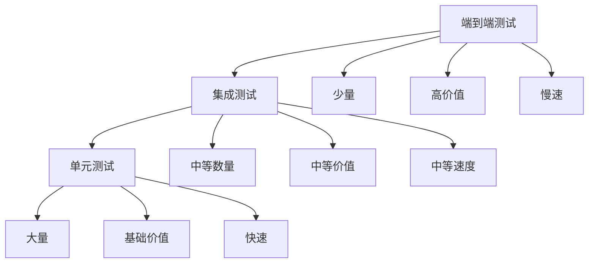

# 09-单元测试指南

## 概述

单元测试是确保VideoAgent系统质量的重要环节。本指南将详细说明如何为VideoAgent的各个组件编写全面的单元测试，包括测试策略、测试用例设计、测试数据准备和测试执行方法。

## 测试策略

### 测试金字塔



### 测试原则

1. **独立性**：每个测试用例应该独立运行
2. **可重复性**：测试结果应该一致
3. **快速执行**：单元测试应该快速完成
4. **全面覆盖**：覆盖所有关键代码路径
5. **易于维护**：测试代码应该易于理解和维护

## 测试框架选择

### Python测试框架

**pytest** (推荐)
- 简洁的语法
- 丰富的插件生态
- 强大的断言功能
- 优秀的报告生成

**unittest** (标准库)
- Python标准库
- 面向对象设计
- 内置测试发现
- 兼容性好

### 测试工具

**测试覆盖率**
- coverage.py：代码覆盖率分析
- pytest-cov：pytest覆盖率插件

**测试数据**
- factory_boy：测试数据工厂
- faker：假数据生成

**模拟和存根**
- unittest.mock：标准库模拟
- pytest-mock：pytest模拟插件

## 步骤1：测试环境搭建

### 1.1 测试依赖安装

**知识点：**
- 测试依赖管理
- 虚拟环境配置
- 测试工具安装

**实现思路：**
1. 创建测试专用虚拟环境
2. 安装测试依赖包
3. 配置测试工具
4. 验证测试环境

**测试依赖：**
```bash
pip install pytest pytest-cov pytest-mock
pip install factory-boy faker
pip install coverage
```

**测试方法：**
- 验证测试环境配置
- 测试工具功能
- 检查依赖完整性

### 1.2 测试目录结构

**知识点：**
- 测试目录组织
- 测试文件命名
- 测试模块结构

**实现思路：**
1. 设计测试目录结构
2. 组织测试文件
3. 配置测试发现
4. 设置测试配置

**目录结构：**
```
tests/
├── __init__.py
├── conftest.py              # pytest配置
├── fixtures/                # 测试夹具
├── unit/                    # 单元测试
│   ├── test_agents/
│   ├── test_config/
│   └── test_utils/
├── integration/             # 集成测试
├── e2e/                     # 端到端测试
└── data/                    # 测试数据
```

**测试方法：**
- 验证目录结构
- 测试文件组织
- 检查配置正确性

### 1.3 测试配置

**知识点：**
- pytest配置
- 测试参数设置
- 环境变量配置

**实现思路：**
1. 配置pytest设置
2. 设置测试参数
3. 配置环境变量
4. 定义测试夹具

**pytest.ini配置：**
```ini
[tool:pytest]
testpaths = tests
python_files = test_*.py
python_classes = Test*
python_functions = test_*
addopts = --cov=environment --cov-report=html --cov-report=term
```

**测试方法：**
- 验证pytest配置
- 测试参数设置
- 检查环境变量

## 步骤2：基础组件测试

### 2.1 BaseTool测试

**知识点：**
- 基类测试
- 接口测试
- 抽象方法测试

**实现思路：**
1. 测试BaseTool基类
2. 验证接口定义
3. 测试抽象方法
4. 检查继承关系

**测试用例：**
- 类定义测试
- 接口实现测试
- 抽象方法测试
- 继承关系测试

**测试方法：**
- 创建测试智能体类
- 验证接口实现
- 测试抽象方法调用
- 检查继承关系

### 2.2 FunctionRegistry测试

**知识点：**
- 注册器功能测试
- 自动发现测试
- 元数据管理测试

**实现思路：**
1. 测试注册器功能
2. 验证自动发现
3. 测试元数据管理
4. 检查注册表操作

**测试用例：**
- 注册功能测试
- 自动发现测试
- 元数据提取测试
- 查询功能测试

**测试方法：**
- 创建测试智能体
- 验证自动注册
- 测试元数据查询
- 检查注册表状态

### 2.3 配置管理测试

**知识点：**
- 配置文件测试
- 配置加载测试
- 配置验证测试

**实现思路：**
1. 测试配置文件格式
2. 验证配置加载
3. 测试配置验证
4. 检查配置更新

**测试用例：**
- 配置文件格式测试
- 配置加载测试
- 配置验证测试
- 配置更新测试

**测试方法：**
- 创建测试配置文件
- 验证配置加载
- 测试配置验证
- 检查配置更新

## 步骤3：核心组件测试

### 3.1 MultiAgent测试

**知识点：**
- 多智能体协调测试
- 工作流执行测试
- 错误处理测试

**实现思路：**
1. 测试多智能体协调
2. 验证工作流执行
3. 测试错误处理
4. 检查状态管理

**测试用例：**
- 协调功能测试
- 工作流执行测试
- 错误处理测试
- 状态管理测试

**测试方法：**
- 创建模拟智能体
- 验证协调功能
- 测试工作流执行
- 检查错误处理

### 3.2 意图分析测试

**知识点：**
- 意图识别测试
- LLM调用测试
- 结果解析测试

**实现思路：**
1. 测试意图识别
2. 验证LLM调用
3. 测试结果解析
4. 检查错误处理

**测试用例：**
- 意图识别测试
- LLM调用测试
- 结果解析测试
- 错误处理测试

**测试方法：**
- 准备测试用例
- 模拟LLM响应
- 验证结果解析
- 测试错误处理

### 3.3 图工作流测试

**知识点：**
- 图生成测试
- 图验证测试
- 执行计划测试

**实现思路：**
1. 测试图生成
2. 验证图结构
3. 测试执行计划
4. 检查参数传递

**测试用例：**
- 图生成测试
- 图验证测试
- 执行计划测试
- 参数传递测试

**测试方法：**
- 创建测试图
- 验证图结构
- 测试执行计划
- 检查参数传递

## 步骤4：智能体测试

### 4.1 音频智能体测试

**知识点：**
- 音频处理测试
- 格式转换测试
- 质量评估测试

**实现思路：**
1. 测试音频处理功能
2. 验证格式转换
3. 测试质量评估
4. 检查错误处理

**测试用例：**
- AudioExtractor测试
- Separator测试
- LoudnessNormalizer测试
- Resampler测试

**测试方法：**
- 准备测试音频文件
- 验证处理功能
- 测试格式转换
- 检查质量评估

### 4.2 视频智能体测试

**知识点：**
- 视频处理测试
- 编辑功能测试
- 格式转换测试

**实现思路：**
1. 测试视频处理功能
2. 验证编辑功能
3. 测试格式转换
4. 检查质量保证

**测试用例：**
- VideoPreloader测试
- VideoSearcher测试
- VideoEditor测试
- VideoConversion测试

**测试方法：**
- 准备测试视频文件
- 验证处理功能
- 测试编辑功能
- 检查格式转换

### 4.3 TTS智能体测试

**知识点：**
- 语音合成测试
- 音色管理测试
- 质量评估测试

**实现思路：**
1. 测试语音合成功能
2. 验证音色管理
3. 测试质量评估
4. 检查性能优化

**测试用例：**
- TTSWriter测试
- TTSInfer测试
- TTSReplace测试
- VoiceGenerator测试

**测试方法：**
- 准备测试文本
- 验证合成功能
- 测试音色管理
- 检查质量评估

## 步骤5：工具集成测试

### 5.1 CosyVoice集成测试

**知识点：**
- 模型加载测试
- API调用测试
- 结果验证测试

**实现思路：**
1. 测试模型加载
2. 验证API调用
3. 测试结果验证
4. 检查错误处理

**测试用例：**
- 模型加载测试
- API调用测试
- 结果验证测试
- 错误处理测试

**测试方法：**
- 验证模型文件
- 测试API调用
- 验证输出质量
- 检查错误处理

### 5.2 Fish Speech集成测试

**知识点：**
- 模型配置测试
- 多语言测试
- 性能测试

**实现思路：**
1. 测试模型配置
2. 验证多语言支持
3. 测试性能指标
4. 检查质量保证

**测试用例：**
- 模型配置测试
- 多语言测试
- 性能测试
- 质量测试

**测试方法：**
- 验证模型配置
- 测试多语言功能
- 检查性能指标
- 验证质量保证

### 5.3 其他工具集成测试

**知识点：**
- 工具集成测试
- 接口兼容性测试
- 性能测试

**实现思路：**
1. 测试工具集成
2. 验证接口兼容性
3. 测试性能指标
4. 检查功能完整性

**测试用例：**
- 工具集成测试
- 接口兼容性测试
- 性能测试
- 功能测试

**测试方法：**
- 验证工具集成
- 测试接口兼容性
- 检查性能指标
- 验证功能完整性

## 步骤6：测试数据管理

### 6.1 测试数据准备

**知识点：**
- 测试数据设计
- 数据生成策略
- 数据管理

**实现思路：**
1. 设计测试数据
2. 实现数据生成
3. 管理测试数据
4. 提供数据访问

**测试数据类型：**
- 音频文件：不同格式、质量、长度
- 视频文件：不同格式、分辨率、时长
- 文本数据：不同语言、长度、内容
- 配置文件：不同参数、格式、内容

**测试方法：**
- 验证测试数据
- 测试数据生成
- 检查数据管理
- 验证数据访问

### 6.2 测试夹具

**知识点：**
- pytest夹具
- 数据夹具
- 模拟夹具

**实现思路：**
1. 创建pytest夹具
2. 实现数据夹具
3. 创建模拟夹具
4. 管理夹具生命周期

**夹具类型：**
- 数据夹具：提供测试数据
- 模拟夹具：模拟外部依赖
- 环境夹具：设置测试环境
- 清理夹具：清理测试环境

**测试方法：**
- 测试夹具功能
- 验证数据提供
- 检查模拟效果
- 验证环境设置

### 6.3 测试数据工厂

**知识点：**
- 数据工厂模式
- 动态数据生成
- 数据关系管理

**实现思路：**
1. 实现数据工厂
2. 支持动态生成
3. 管理数据关系
4. 提供数据构建

**工厂类型：**
- 音频文件工厂
- 视频文件工厂
- 文本数据工厂
- 配置数据工厂

**测试方法：**
- 测试数据工厂
- 验证动态生成
- 检查数据关系
- 验证数据构建

## 步骤7：测试执行和报告

### 7.1 测试执行

**知识点：**
- 测试运行策略
- 并行执行
- 测试选择

**实现思路：**
1. 设计测试运行策略
2. 实现并行执行
3. 支持测试选择
4. 提供执行控制

**执行策略：**
- 全量测试：运行所有测试
- 增量测试：运行变更相关测试
- 冒烟测试：运行关键测试
- 回归测试：运行历史问题测试

**测试方法：**
- 验证测试执行
- 检查并行执行
- 测试选择功能
- 验证执行控制

### 7.2 测试报告

**知识点：**
- 测试结果收集
- 报告生成
- 结果分析

**实现思路：**
1. 收集测试结果
2. 生成测试报告
3. 分析测试结果
4. 提供改进建议

**报告类型：**
- 文本报告：控制台输出
- HTML报告：网页格式
- XML报告：机器可读
- JSON报告：结构化数据

**测试方法：**
- 验证结果收集
- 检查报告生成
- 测试结果分析
- 验证改进建议

### 7.3 覆盖率分析

**知识点：**
- 代码覆盖率
- 分支覆盖率
- 覆盖率报告

**实现思路：**
1. 测量代码覆盖率
2. 分析分支覆盖率
3. 生成覆盖率报告
4. 提供覆盖率建议

**覆盖率指标：**
- 行覆盖率：代码行覆盖比例
- 分支覆盖率：分支覆盖比例
- 函数覆盖率：函数覆盖比例
- 类覆盖率：类覆盖比例

**测试方法：**
- 验证覆盖率测量
- 检查覆盖率分析
- 测试报告生成
- 验证覆盖率建议

## 步骤8：持续集成

### 8.1 CI/CD集成

**知识点：**
- 持续集成配置
- 自动化测试
- 测试环境管理

**实现思路：**
1. 配置持续集成
2. 实现自动化测试
3. 管理测试环境
4. 提供集成反馈

**CI/CD流程：**
- 代码提交触发
- 自动运行测试
- 生成测试报告
- 提供反馈结果

**测试方法：**
- 验证CI配置
- 测试自动化流程
- 检查环境管理
- 验证反馈机制

### 8.2 测试质量门禁

**知识点：**
- 质量门禁设置
- 测试通过标准
- 质量评估

**实现思路：**
1. 设置质量门禁
2. 定义通过标准
3. 实现质量评估
4. 提供质量反馈

**门禁标准：**
- 测试通过率：100%
- 代码覆盖率：>80%
- 性能指标：满足要求
- 质量评分：>90%

**测试方法：**
- 验证门禁设置
- 测试通过标准
- 检查质量评估
- 验证质量反馈

## 测试最佳实践

### 测试编写原则

1. **AAA模式**：Arrange、Act、Assert
2. **单一职责**：每个测试只验证一个功能
3. **独立性**：测试之间不相互依赖
4. **可读性**：测试代码应该清晰易懂
5. **可维护性**：测试代码应该易于维护

### 测试命名规范

1. **测试函数**：test_功能描述
2. **测试类**：Test类名
3. **测试文件**：test_模块名.py
4. **测试目录**：tests/

### 测试数据管理

1. **使用夹具**：避免硬编码数据
2. **数据隔离**：每个测试使用独立数据
3. **数据清理**：测试后清理数据
4. **数据验证**：验证测试数据正确性

## 故障排除

### 常见问题

**1. 测试失败**
- 检查测试环境
- 验证测试数据
- 查看错误日志
- 检查依赖关系

**2. 覆盖率低**
- 增加测试用例
- 检查测试覆盖
- 优化测试策略
- 分析未覆盖代码

**3. 测试速度慢**
- 优化测试数据
- 使用模拟对象
- 并行执行测试
- 优化测试环境

**4. 测试不稳定**
- 检查测试独立性
- 验证数据清理
- 检查时间依赖
- 优化测试环境

### 调试技巧

**调试工具：**
- pytest调试模式
- 日志分析工具
- 性能分析工具
- 覆盖率分析工具

**调试方法：**
- 添加详细日志
- 使用断点调试
- 分析测试轨迹
- 检查环境状态

## 下一步

完成单元测试指南后，请继续阅读：
- [10-集成测试指南](./10-integration-testing.md)
- [11-端到端测试](./11-e2e-testing.md)

## 知识点总结

1. **测试策略**：全面的测试策略和原则
2. **测试框架**：pytest等现代测试框架
3. **测试组织**：清晰的测试目录结构
4. **测试数据**：完善的测试数据管理
5. **持续集成**：自动化测试和CI/CD集成

通过系统性地实施单元测试，您将确保VideoAgent系统的质量和稳定性。


