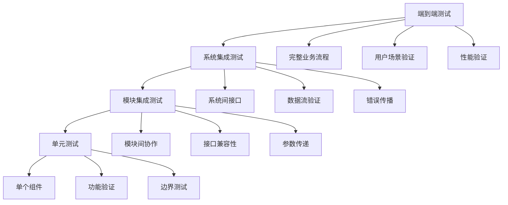

# 10-集成测试指南

## 概述

集成测试是验证VideoAgent系统各组件之间协作功能的重要测试阶段。本指南将详细说明如何设计和执行集成测试，确保系统各模块能够正确协作，实现完整的业务流程。

## 集成测试策略

### 测试层次

### 集成测试类型

1. **大爆炸集成**：一次性集成所有模块
2. **增量集成**：逐步集成模块
3. **自顶向下集成**：从顶层模块开始
4. **自底向上集成**：从底层模块开始
5. **混合集成**：结合多种策略

## 步骤1：集成测试环境搭建

### 1.1 测试环境配置

**知识点：**
- 集成测试环境
- 测试数据准备
- 环境隔离

**实现思路：**
1. 搭建集成测试环境
2. 准备测试数据
3. 配置环境隔离
4. 验证环境可用性

**环境要求：**
- 独立的测试环境
- 完整的依赖服务
- 测试数据隔离
- 环境状态管理

**测试方法：**
- 验证环境配置
- 测试服务可用性
- 检查数据隔离
- 验证环境状态

### 1.2 测试数据管理

**知识点：**
- 集成测试数据
- 数据关系管理
- 数据一致性

**实现思路：**
1. 设计集成测试数据
2. 管理数据关系
3. 保证数据一致性
4. 提供数据访问

**数据类型：**
- 音频文件：不同格式和质量
- 视频文件：不同分辨率和时长
- 文本数据：不同语言和内容
- 配置文件：不同参数设置

**测试方法：**
- 验证测试数据
- 检查数据关系
- 测试数据一致性
- 验证数据访问

### 1.3 模拟和存根

**知识点：**
- 外部依赖模拟
- 服务存根
- 数据模拟

**实现思路：**
1. 识别外部依赖
2. 创建模拟对象
3. 实现服务存根
4. 管理模拟数据

**模拟类型：**
- LLM API模拟
- 文件系统模拟
- 网络服务模拟
- 数据库模拟

**测试方法：**
- 验证模拟对象
- 测试服务存根
- 检查数据模拟
- 验证模拟效果

## 步骤2：核心组件集成测试

### 2.1 多智能体系统集成

**知识点：**
- 智能体协作测试
- 工作流执行测试
- 状态管理测试

**实现思路：**
1. 测试智能体协作
2. 验证工作流执行
3. 测试状态管理
4. 检查错误处理

**测试场景：**
- 简单工作流：2-3个智能体协作
- 复杂工作流：5+个智能体协作
- 并行工作流：可并行执行的智能体
- 错误恢复：智能体执行失败恢复

**测试方法：**
- 创建测试工作流
- 验证智能体协作
- 测试工作流执行
- 检查状态管理

### 2.2 意图分析系统集成

**知识点：**
- 意图识别集成
- LLM调用集成
- 智能体映射集成

**实现思路：**
1. 测试意图识别集成
2. 验证LLM调用集成
3. 测试智能体映射集成
4. 检查错误处理集成

**测试场景：**
- 单意图识别：识别单一意图
- 多意图识别：识别多个意图
- 复杂意图：识别复杂意图
- 错误处理：处理识别错误

**测试方法：**
- 准备测试用例
- 验证意图识别
- 测试LLM调用
- 检查智能体映射

### 2.3 图工作流系统集成

**知识点：**
- 图生成集成
- 图验证集成
- 执行计划集成

**实现思路：**
1. 测试图生成集成
2. 验证图验证集成
3. 测试执行计划集成
4. 检查参数传递集成

**测试场景：**
- 简单图生成：生成简单执行图
- 复杂图生成：生成复杂执行图
- 图验证：验证图的有效性
- 执行计划：生成执行计划

**测试方法：**
- 创建测试场景
- 验证图生成
- 测试图验证
- 检查执行计划

## 步骤3：工具集成测试

### 3.1 语音合成工具集成

**知识点：**
- TTS工具集成
- 音色管理集成
- 质量评估集成

**实现思路：**
1. 测试TTS工具集成
2. 验证音色管理集成
3. 测试质量评估集成
4. 检查性能优化集成

**测试场景：**
- CosyVoice集成：测试CosyVoice集成
- Fish Speech集成：测试Fish Speech集成
- 多语言支持：测试多语言合成
- 音色克隆：测试音色克隆功能

**测试方法：**
- 准备测试文本
- 验证TTS集成
- 测试音色管理
- 检查质量评估

### 3.2 视频处理工具集成

**知识点：**
- 视频工具集成
- 编辑功能集成
- 格式转换集成

**实现思路：**
1. 测试视频工具集成
2. 验证编辑功能集成
3. 测试格式转换集成
4. 检查质量优化集成

**测试场景：**
- 视频预加载：测试视频预加载
- 视频搜索：测试视频搜索
- 视频编辑：测试视频编辑
- 格式转换：测试格式转换

**测试方法：**
- 准备测试视频
- 验证工具集成
- 测试编辑功能
- 检查格式转换

### 3.3 音频处理工具集成

**知识点：**
- 音频工具集成
- 处理功能集成
- 质量优化集成

**实现思路：**
1. 测试音频工具集成
2. 验证处理功能集成
3. 测试质量优化集成
4. 检查性能优化集成

**测试场景：**
- 音频提取：测试音频提取
- 音频分离：测试音频分离
- 响度标准化：测试响度标准化
- 音频混合：测试音频混合

**测试方法：**
- 准备测试音频
- 验证工具集成
- 测试处理功能
- 检查质量优化

## 步骤4：数据流集成测试

### 4.1 参数传递测试

**知识点：**
- 参数传递验证
- 数据类型转换
- 参数验证

**实现思路：**
1. 测试参数传递
2. 验证数据类型转换
3. 测试参数验证
4. 检查错误处理

**测试场景：**
- 简单参数传递：测试简单参数传递
- 复杂参数传递：测试复杂参数传递
- 类型转换：测试数据类型转换
- 参数验证：测试参数验证

**测试方法：**
- 创建测试参数
- 验证参数传递
- 测试类型转换
- 检查参数验证

### 4.2 状态管理测试

**知识点：**
- 状态同步测试
- 状态持久化测试
- 状态一致性测试

**实现思路：**
1. 测试状态同步
2. 验证状态持久化
3. 测试状态一致性
4. 检查状态恢复

**测试场景：**
- 状态同步：测试状态同步
- 状态持久化：测试状态持久化
- 状态一致性：测试状态一致性
- 状态恢复：测试状态恢复

**测试方法：**
- 创建测试状态
- 验证状态同步
- 测试状态持久化
- 检查状态一致性

### 4.3 错误传播测试

**知识点：**
- 错误传播验证
- 错误处理测试
- 错误恢复测试

**实现思路：**
1. 测试错误传播
2. 验证错误处理
3. 测试错误恢复
4. 检查错误日志

**测试场景：**
- 错误传播：测试错误传播
- 错误处理：测试错误处理
- 错误恢复：测试错误恢复
- 错误日志：测试错误日志

**测试方法：**
- 故意触发错误
- 验证错误传播
- 测试错误处理
- 检查错误恢复

## 步骤5：性能集成测试

### 5.1 并发处理测试

**知识点：**
- 并发执行测试
- 资源竞争测试
- 性能瓶颈测试

**实现思路：**
1. 测试并发执行
2. 验证资源竞争处理
3. 测试性能瓶颈
4. 检查资源使用

**测试场景：**
- 并发执行：测试并发执行
- 资源竞争：测试资源竞争
- 性能瓶颈：测试性能瓶颈
- 资源使用：测试资源使用

**测试方法：**
- 创建并发测试
- 验证并发执行
- 测试资源竞争
- 检查性能瓶颈

### 5.2 内存管理测试

**知识点：**
- 内存使用测试
- 内存泄漏测试
- 内存优化测试

**实现思路：**
1. 测试内存使用
2. 验证内存泄漏
3. 测试内存优化
4. 检查内存管理

**测试场景：**
- 内存使用：测试内存使用
- 内存泄漏：测试内存泄漏
- 内存优化：测试内存优化
- 内存管理：测试内存管理

**测试方法：**
- 监控内存使用
- 验证内存泄漏
- 测试内存优化
- 检查内存管理

### 5.3 性能监控测试

**知识点：**
- 性能指标监控
- 性能分析测试
- 性能优化测试

**实现思路：**
1. 监控性能指标
2. 分析性能数据
3. 测试性能优化
4. 提供性能报告

**测试场景：**
- 性能监控：测试性能监控
- 性能分析：测试性能分析
- 性能优化：测试性能优化
- 性能报告：测试性能报告

**测试方法：**
- 监控性能指标
- 分析性能数据
- 测试性能优化
- 验证性能报告

## 步骤6：端到端集成测试

### 6.1 完整业务流程测试

**知识点：**
- 业务流程验证
- 端到端测试
- 用户场景测试

**实现思路：**
1. 设计完整业务流程
2. 执行端到端测试
3. 验证用户场景
4. 检查业务结果

**测试场景：**
- 音频转录：完整的音频转录流程
- 视频编辑：完整的视频编辑流程
- 语音合成：完整的语音合成流程
- 复杂任务：复杂的多模态任务

**测试方法：**
- 设计业务流程
- 执行端到端测试
- 验证用户场景
- 检查业务结果

### 6.2 用户交互测试

**知识点：**
- 用户交互验证
- 界面测试
- 用户体验测试

**实现思路：**
1. 测试用户交互
2. 验证界面功能
3. 测试用户体验
4. 检查交互反馈

**测试场景：**
- 用户输入：测试用户输入
- 界面响应：测试界面响应
- 用户体验：测试用户体验
- 交互反馈：测试交互反馈

**测试方法：**
- 模拟用户交互
- 验证界面功能
- 测试用户体验
- 检查交互反馈

### 6.3 系统稳定性测试

**知识点：**
- 系统稳定性验证
- 长时间运行测试
- 压力测试

**实现思路：**
1. 测试系统稳定性
2. 验证长时间运行
3. 执行压力测试
4. 检查系统恢复

**测试场景：**
- 稳定性测试：测试系统稳定性
- 长时间运行：测试长时间运行
- 压力测试：执行压力测试
- 系统恢复：测试系统恢复

**测试方法：**
- 长时间运行测试
- 执行压力测试
- 验证系统稳定性
- 检查系统恢复

## 步骤7：测试自动化

### 7.1 自动化测试框架

**知识点：**
- 自动化框架设计
- 测试脚本管理
- 测试执行自动化

**实现思路：**
1. 设计自动化框架
2. 管理测试脚本
3. 实现执行自动化
4. 提供测试报告

**框架组件：**
- 测试执行引擎
- 测试数据管理
- 测试报告生成
- 测试结果分析

**测试方法：**
- 验证框架设计
- 测试脚本管理
- 验证执行自动化
- 检查测试报告

### 7.2 持续集成测试

**知识点：**
- CI/CD集成
- 自动化测试触发
- 测试结果反馈

**实现思路：**
1. 集成CI/CD系统
2. 实现自动化触发
3. 提供测试反馈
4. 管理测试结果

**CI/CD流程：**
- 代码提交触发
- 自动运行测试
- 生成测试报告
- 提供反馈结果

**测试方法：**
- 验证CI/CD集成
- 测试自动化触发
- 检查测试反馈
- 验证测试结果

### 7.3 测试报告和分析

**知识点：**
- 测试报告生成
- 测试结果分析
- 质量趋势分析

**实现思路：**
1. 生成测试报告
2. 分析测试结果
3. 分析质量趋势
4. 提供改进建议

**报告类型：**
- 测试执行报告
- 测试覆盖率报告
- 性能测试报告
- 质量趋势报告

**测试方法：**
- 验证报告生成
- 测试结果分析
- 检查质量趋势
- 验证改进建议

## 步骤8：测试环境管理

### 8.1 环境配置管理

**知识点：**
- 环境配置管理
- 环境版本控制
- 环境部署自动化

**实现思路：**
1. 管理环境配置
2. 控制环境版本
3. 实现部署自动化
4. 提供环境监控

**环境类型：**
- 开发环境
- 测试环境
- 预生产环境
- 生产环境

**测试方法：**
- 验证环境配置
- 测试版本控制
- 验证部署自动化
- 检查环境监控

### 8.2 测试数据管理

**知识点：**
- 测试数据版本控制
- 数据备份和恢复
- 数据一致性管理

**实现思路：**
1. 控制数据版本
2. 实现数据备份
3. 管理数据一致性
4. 提供数据恢复

**数据管理：**
- 数据版本控制
- 数据备份策略
- 数据一致性检查
- 数据恢复流程

**测试方法：**
- 验证数据版本控制
- 测试数据备份
- 检查数据一致性
- 验证数据恢复

### 8.3 环境监控和告警

**知识点：**
- 环境监控
- 告警机制
- 故障处理

**实现思路：**
1. 实现环境监控
2. 设置告警机制
3. 处理环境故障
4. 提供监控报告

**监控内容：**
- 系统资源监控
- 服务状态监控
- 性能指标监控
- 错误日志监控

**测试方法：**
- 验证环境监控
- 测试告警机制
- 检查故障处理
- 验证监控报告

## 测试最佳实践

### 测试设计原则

1. **真实场景**：基于真实使用场景设计测试
2. **数据驱动**：使用真实数据进行测试
3. **边界测试**：测试边界条件和异常情况
4. **性能验证**：验证系统性能指标
5. **可维护性**：测试代码应该易于维护

### 测试执行策略

1. **分层测试**：按照测试层次执行测试
2. **增量测试**：逐步增加测试复杂度
3. **并行执行**：并行执行独立测试
4. **结果分析**：分析测试结果和趋势
5. **持续改进**：持续改进测试策略

### 测试质量保证

1. **测试覆盖**：确保足够的测试覆盖
2. **测试稳定性**：保证测试结果稳定
3. **测试效率**：优化测试执行效率
4. **测试维护**：及时维护测试代码
5. **测试文档**：维护测试文档

## 故障排除

### 常见问题

**1. 集成测试失败**
- 检查环境配置
- 验证服务依赖
- 查看错误日志
- 检查数据一致性

**2. 性能问题**
- 分析性能瓶颈
- 优化资源使用
- 调整并发参数
- 检查系统负载

**3. 数据不一致**
- 检查数据同步
- 验证数据完整性
- 检查数据版本
- 修复数据问题

**4. 环境问题**
- 检查环境配置
- 验证服务状态
- 检查网络连接
- 修复环境问题

### 调试技巧

**调试工具：**
- 日志分析工具
- 性能分析工具
- 网络分析工具
- 数据库分析工具

**调试方法：**
- 添加详细日志
- 使用调试模式
- 分析执行轨迹
- 检查系统状态

## 下一步

完成集成测试指南后，请继续阅读：
- [11-端到端测试](./11-e2e-testing.md)
- [12-自定义智能体开发](./12-custom-agents.md)

## 知识点总结

1. **集成策略**：全面的集成测试策略和方法
2. **环境管理**：完善的测试环境管理
3. **数据管理**：系统的测试数据管理
4. **性能测试**：全面的性能集成测试
5. **自动化**：完整的测试自动化方案

通过系统性地实施集成测试，您将确保VideoAgent系统各组件能够正确协作，实现完整的业务流程。

