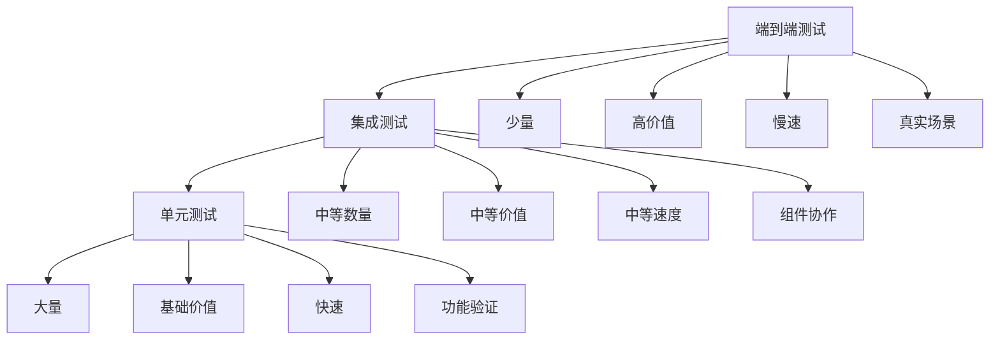

# 11-端到端测试

## 概述

端到端测试是验证VideoAgent系统完整业务流程的最高级别测试。本指南将详细说明如何设计和执行端到端测试，确保系统能够满足真实用户场景的需求，提供完整的视频处理解决方案。

## 端到端测试策略

### 测试金字塔

### 端到端测试特点

1. **真实场景**：基于真实用户使用场景
2. **完整流程**：覆盖完整的业务流程
3. **系统验证**：验证整个系统的功能
4. **用户视角**：从用户角度验证系统
5. **质量保证**：确保系统质量

## 步骤1：测试场景设计

### 1.1 用户场景分析

**知识点：**
- 用户需求分析
- 使用场景识别
- 业务流程梳理

**实现思路：**
1. 分析用户需求
2. 识别使用场景
3. 梳理业务流程
4. 设计测试场景

**主要场景：**
- 音频转录：将音频转换为文本
- 视频编辑：编辑和合成视频
- 语音合成：将文本转换为语音
- 视频重混音：重新制作视频内容
- 多模态任务：复杂的多模态处理

**测试方法：**
- 分析用户需求
- 识别关键场景
- 设计测试用例
- 验证场景覆盖

### 1.2 业务流程设计

**知识点：**
- 业务流程建模
- 流程步骤定义
- 数据流设计

**实现思路：**
1. 建模业务流程
2. 定义流程步骤
3. 设计数据流
4. 验证流程完整性

**流程类型：**
- 简单流程：单一功能流程
- 复杂流程：多步骤流程
- 并行流程：可并行执行的流程
- 条件流程：有条件分支的流程

**测试方法：**
- 建模业务流程
- 验证流程步骤
- 测试数据流
- 检查流程完整性

### 1.3 测试用例设计

**知识点：**
- 测试用例设计
- 用例优先级
- 用例覆盖度

**实现思路：**
1. 设计测试用例
2. 确定用例优先级
3. 计算覆盖度
4. 优化用例设计

**用例类型：**
- 正常流程：正常业务流程
- 异常流程：异常处理流程
- 边界流程：边界条件流程
- 性能流程：性能测试流程

**测试方法：**
- 设计测试用例
- 验证用例优先级
- 检查覆盖度
- 优化用例设计

## 步骤2：测试环境搭建

### 2.1 生产环境模拟

**知识点：**
- 生产环境模拟
- 环境配置管理
- 服务依赖管理

**实现思路：**
1. 模拟生产环境
2. 管理环境配置
3. 管理服务依赖
4. 验证环境可用性

**环境要求：**
- 完整的服务栈
- 真实的数据环境
- 生产级配置
- 监控和日志

**测试方法：**
- 验证环境模拟
- 检查环境配置
- 测试服务依赖
- 验证环境可用性

### 2.2 测试数据准备

**知识点：**
- 真实数据准备
- 数据质量保证
- 数据隐私保护

**实现思路：**
1. 准备真实数据
2. 保证数据质量
3. 保护数据隐私
4. 管理数据生命周期

**数据类型：**
- 音频文件：真实音频样本
- 视频文件：真实视频样本
- 文本数据：真实文本内容
- 用户数据：模拟用户数据

**测试方法：**
- 验证数据准备
- 检查数据质量
- 测试数据隐私
- 验证数据管理

### 2.3 测试工具配置

**知识点：**
- 测试工具选择
- 工具配置管理
- 工具集成

**实现思路：**
1. 选择测试工具
2. 配置测试工具
3. 集成测试工具
4. 验证工具功能

**工具类型：**
- 自动化测试工具
- 性能测试工具
- 监控工具
- 报告工具

**测试方法：**
- 验证工具选择
- 检查工具配置
- 测试工具集成
- 验证工具功能

## 步骤3：核心场景测试

### 3.1 音频转录场景

**知识点：**
- 音频转录流程
- 质量验证
- 性能测试

**实现思路：**
1. 执行音频转录流程
2. 验证转录质量
3. 测试转录性能
4. 检查错误处理

**测试流程：**
1. 上传音频文件
2. 选择转录参数
3. 执行转录处理
4. 验证转录结果
5. 下载转录文本

**验证点：**
- 转录准确性
- 处理时间
- 错误处理
- 用户体验

**测试方法：**
- 准备测试音频
- 执行转录流程
- 验证转录质量
- 检查性能指标

### 3.2 视频编辑场景

**知识点：**
- 视频编辑流程
- 编辑质量验证
- 性能测试

**实现思路：**
1. 执行视频编辑流程
2. 验证编辑质量
3. 测试编辑性能
4. 检查用户体验

**测试流程：**
1. 上传视频文件
2. 选择编辑功能
3. 配置编辑参数
4. 执行编辑处理
5. 预览编辑结果
6. 下载编辑视频

**验证点：**
- 编辑质量
- 处理时间
- 功能完整性
- 用户体验

**测试方法：**
- 准备测试视频
- 执行编辑流程
- 验证编辑质量
- 检查性能指标

### 3.3 语音合成场景

**知识点：**
- 语音合成流程
- 合成质量验证
- 性能测试

**实现思路：**
1. 执行语音合成流程
2. 验证合成质量
3. 测试合成性能
4. 检查用户体验

**测试流程：**
1. 输入文本内容
2. 选择音色参数
3. 配置合成参数
4. 执行合成处理
5. 预览合成结果
6. 下载合成音频

**验证点：**
- 合成质量
- 音色准确性
- 处理时间
- 用户体验

**测试方法：**
- 准备测试文本
- 执行合成流程
- 验证合成质量
- 检查性能指标

### 3.4 视频重混音场景

**知识点：**
- 视频重混音流程
- 重混音质量验证
- 性能测试

**实现思路：**
1. 执行视频重混音流程
2. 验证重混音质量
3. 测试重混音性能
4. 检查用户体验

**测试流程：**
1. 上传原始视频
2. 选择重混音类型
3. 配置重混音参数
4. 执行重混音处理
5. 预览重混音结果
6. 下载重混音视频

**验证点：**
- 重混音质量
- 内容准确性
- 处理时间
- 用户体验

**测试方法：**
- 准备测试视频
- 执行重混音流程
- 验证重混音质量
- 检查性能指标

## 步骤4：复杂场景测试

### 4.1 多模态任务场景

**知识点：**
- 多模态处理流程
- 模态融合验证
- 性能测试

**实现思路：**
1. 执行多模态处理流程
2. 验证模态融合
3. 测试处理性能
4. 检查结果质量

**测试流程：**
1. 上传多模态内容
2. 选择处理任务
3. 配置处理参数
4. 执行多模态处理
5. 验证融合结果
6. 下载处理结果

**验证点：**
- 模态融合质量
- 处理准确性
- 处理时间
- 结果质量

**测试方法：**
- 准备多模态数据
- 执行处理流程
- 验证融合质量
- 检查性能指标

### 4.2 批量处理场景

**知识点：**
- 批量处理流程
- 处理效率验证
- 资源管理测试

**实现思路：**
1. 执行批量处理流程
2. 验证处理效率
3. 测试资源管理
4. 检查处理质量

**测试流程：**
1. 上传批量文件
2. 选择处理任务
3. 配置批量参数
4. 执行批量处理
5. 监控处理进度
6. 下载处理结果

**验证点：**
- 处理效率
- 资源使用
- 处理质量
- 进度监控

**测试方法：**
- 准备批量数据
- 执行批量处理
- 验证处理效率
- 检查资源使用

### 4.3 实时处理场景

**知识点：**
- 实时处理流程
- 延迟验证
- 流式处理测试

**实现思路：**
1. 执行实时处理流程
2. 验证处理延迟
3. 测试流式处理
4. 检查处理质量

**测试流程：**
1. 启动实时处理
2. 输入实时数据
3. 监控处理延迟
4. 验证流式输出
5. 检查处理质量
6. 停止实时处理

**验证点：**
- 处理延迟
- 流式处理
- 处理质量
- 系统稳定性

**测试方法：**
- 准备实时数据
- 执行实时处理
- 验证处理延迟
- 检查流式处理

## 步骤5：性能测试

### 5.1 负载测试

**知识点：**
- 负载测试设计
- 性能指标监控
- 瓶颈分析

**实现思路：**
1. 设计负载测试
2. 监控性能指标
3. 分析性能瓶颈
4. 优化系统性能

**测试场景：**
- 正常负载：正常用户负载
- 高负载：高用户负载
- 峰值负载：峰值用户负载
- 压力测试：极限负载测试

**测试方法：**
- 设计负载场景
- 执行负载测试
- 监控性能指标
- 分析性能瓶颈

### 5.2 压力测试

**知识点：**
- 压力测试设计
- 系统极限测试
- 故障恢复测试

**实现思路：**
1. 设计压力测试
2. 测试系统极限
3. 测试故障恢复
4. 验证系统稳定性

**测试场景：**
- 并发用户：大量并发用户
- 数据处理：大量数据处理
- 资源消耗：高资源消耗
- 系统故障：系统故障恢复

**测试方法：**
- 设计压力场景
- 执行压力测试
- 测试系统极限
- 验证故障恢复

### 5.3 稳定性测试

**知识点：**
- 稳定性测试设计
- 长时间运行测试
- 内存泄漏测试

**实现思路：**
1. 设计稳定性测试
2. 执行长时间运行
3. 测试内存泄漏
4. 验证系统稳定性

**测试场景：**
- 长时间运行：24小时连续运行
- 内存监控：内存使用监控
- 性能监控：性能指标监控
- 错误监控：错误日志监控

**测试方法：**
- 设计稳定性场景
- 执行长时间测试
- 监控系统状态
- 验证系统稳定性

## 步骤6：用户体验测试

### 6.1 用户界面测试

**知识点：**
- 界面功能测试
- 界面响应测试
- 界面易用性测试

**实现思路：**
1. 测试界面功能
2. 验证界面响应
3. 测试界面易用性
4. 检查界面一致性

**测试内容：**
- 功能完整性：所有功能可用
- 响应速度：界面响应速度
- 易用性：界面易用性
- 一致性：界面一致性

**测试方法：**
- 测试界面功能
- 验证界面响应
- 测试界面易用性
- 检查界面一致性

### 6.2 用户交互测试

**知识点：**
- 交互流程测试
- 交互响应测试
- 交互体验测试

**实现思路：**
1. 测试交互流程
2. 验证交互响应
3. 测试交互体验
4. 检查交互反馈

**测试内容：**
- 交互流程：完整的交互流程
- 交互响应：交互响应时间
- 交互体验：交互体验质量
- 交互反馈：交互反馈机制

**测试方法：**
- 测试交互流程
- 验证交互响应
- 测试交互体验
- 检查交互反馈

### 6.3 用户满意度测试

**知识点：**
- 满意度调查
- 用户反馈收集
- 满意度分析

**实现思路：**
1. 进行满意度调查
2. 收集用户反馈
3. 分析满意度数据
4. 提供改进建议

**调查内容：**
- 功能满意度：功能满意度调查
- 性能满意度：性能满意度调查
- 易用性满意度：易用性满意度调查
- 整体满意度：整体满意度调查

**测试方法：**
- 进行满意度调查
- 收集用户反馈
- 分析满意度数据
- 提供改进建议

## 步骤7：测试自动化

### 7.1 自动化测试框架

**知识点：**
- 自动化框架设计
- 测试脚本管理
- 测试执行自动化

**实现思路：**
1. 设计自动化框架
2. 管理测试脚本
3. 实现执行自动化
4. 提供测试报告

**框架组件：**
- 测试执行引擎
- 测试数据管理
- 测试报告生成
- 测试结果分析

**测试方法：**
- 验证框架设计
- 测试脚本管理
- 验证执行自动化
- 检查测试报告

### 7.2 持续集成测试

**知识点：**
- CI/CD集成
- 自动化测试触发
- 测试结果反馈

**实现思路：**
1. 集成CI/CD系统
2. 实现自动化触发
3. 提供测试反馈
4. 管理测试结果

**CI/CD流程：**
- 代码提交触发
- 自动运行测试
- 生成测试报告
- 提供反馈结果

**测试方法：**
- 验证CI/CD集成
- 测试自动化触发
- 检查测试反馈
- 验证测试结果

### 7.3 测试报告和分析

**知识点：**
- 测试报告生成
- 测试结果分析
- 质量趋势分析

**实现思路：**
1. 生成测试报告
2. 分析测试结果
3. 分析质量趋势
4. 提供改进建议

**报告类型：**
- 测试执行报告
- 性能测试报告
- 用户体验报告
- 质量趋势报告

**测试方法：**
- 验证报告生成
- 测试结果分析
- 检查质量趋势
- 验证改进建议

## 步骤8：测试环境管理

### 8.1 环境配置管理

**知识点：**
- 环境配置管理
- 环境版本控制
- 环境部署自动化

**实现思路：**
1. 管理环境配置
2. 控制环境版本
3. 实现部署自动化
4. 提供环境监控

**环境类型：**
- 开发环境
- 测试环境
- 预生产环境
- 生产环境

**测试方法：**
- 验证环境配置
- 测试版本控制
- 验证部署自动化
- 检查环境监控

### 8.2 测试数据管理

**知识点：**
- 测试数据版本控制
- 数据备份和恢复
- 数据一致性管理

**实现思路：**
1. 控制数据版本
2. 实现数据备份
3. 管理数据一致性
4. 提供数据恢复

**数据管理：**
- 数据版本控制
- 数据备份策略
- 数据一致性检查
- 数据恢复流程

**测试方法：**
- 验证数据版本控制
- 测试数据备份
- 检查数据一致性
- 验证数据恢复

### 8.3 环境监控和告警

**知识点：**
- 环境监控
- 告警机制
- 故障处理

**实现思路：**
1. 实现环境监控
2. 设置告警机制
3. 处理环境故障
4. 提供监控报告

**监控内容：**
- 系统资源监控
- 服务状态监控
- 性能指标监控
- 错误日志监控

**测试方法：**
- 验证环境监控
- 测试告警机制
- 检查故障处理
- 验证监控报告

## 测试最佳实践

### 测试设计原则

1. **真实场景**：基于真实用户场景设计测试
2. **完整流程**：覆盖完整的业务流程
3. **用户视角**：从用户角度验证系统
4. **质量保证**：确保系统质量
5. **持续改进**：持续改进测试策略

### 测试执行策略

1. **分层执行**：按照测试层次执行测试
2. **优先级执行**：按照优先级执行测试
3. **并行执行**：并行执行独立测试
4. **结果分析**：分析测试结果和趋势
5. **持续改进**：持续改进测试策略

### 测试质量保证

1. **测试覆盖**：确保足够的测试覆盖
2. **测试稳定性**：保证测试结果稳定
3. **测试效率**：优化测试执行效率
4. **测试维护**：及时维护测试代码
5. **测试文档**：维护测试文档

## 故障排除

### 常见问题

**1. 端到端测试失败**
- 检查环境配置
- 验证服务依赖
- 查看错误日志
- 检查数据一致性

**2. 性能问题**
- 分析性能瓶颈
- 优化资源使用
- 调整并发参数
- 检查系统负载

**3. 用户体验问题**
- 检查界面功能
- 验证交互流程
- 测试响应速度
- 优化用户体验

**4. 环境问题**
- 检查环境配置
- 验证服务状态
- 检查网络连接
- 修复环境问题

### 调试技巧

**调试工具：**
- 日志分析工具
- 性能分析工具
- 网络分析工具
- 用户体验分析工具

**调试方法：**
- 添加详细日志
- 使用调试模式
- 分析执行轨迹
- 检查系统状态

## 下一步

完成端到端测试指南后，请继续阅读：
- [12-自定义智能体开发](./12-custom-agents.md)
- [13-性能优化指南](./13-performance-optimization.md)

## 知识点总结

1. **场景设计**：全面的测试场景设计方法
2. **环境管理**：完善的测试环境管理
3. **性能测试**：全面的性能测试策略
4. **用户体验**：系统的用户体验测试
5. **自动化**：完整的测试自动化方案

通过系统性地实施端到端测试，您将确保VideoAgent系统能够满足真实用户场景的需求，提供完整的视频处理解决方案。

