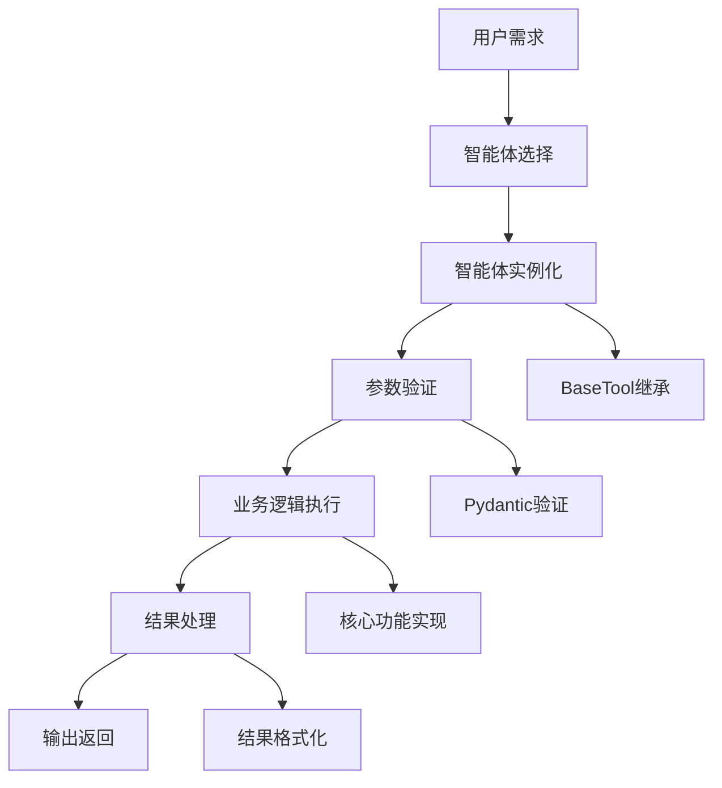

# 12-自定义智能体开发

## 概述

自定义智能体开发是VideoAgent系统扩展性的重要体现。本指南将详细说明如何开发自定义智能体，包括智能体设计、实现、测试和集成，帮助您扩展VideoAgent的功能，满足特定的业务需求。

## 智能体开发基础

### 智能体架构

### 智能体生命周期

1. **注册阶段**：智能体注册到系统
2. **选择阶段**：根据意图选择智能体
3. **实例化阶段**：创建智能体实例
4. **执行阶段**：执行业务逻辑
5. **结果阶段**：返回处理结果

## 步骤1：智能体设计

### 1.1 需求分析

**知识点：**
- 功能需求分析
- 输入输出定义
- 性能要求分析

**实现思路：**
1. 分析功能需求
2. 定义输入输出
3. 分析性能要求
4. 设计智能体接口

**设计要素：**
- 功能描述：智能体的核心功能
- 输入参数：所需的输入参数
- 输出结果：预期的输出结果
- 性能指标：性能要求
- 错误处理：错误处理策略

**测试方法：**
- 验证需求分析
- 检查接口设计
- 测试性能要求
- 验证错误处理

### 1.2 接口设计

**知识点：**
- 接口规范定义
- 参数类型设计
- 返回值设计

**实现思路：**
1. 定义接口规范
2. 设计参数类型
3. 设计返回值
4. 验证接口设计

**接口要素：**
- 输入模式：InputSchema定义
- 输出模式：OutputSchema定义
- 执行方法：execute方法实现
- 错误处理：异常处理机制

**测试方法：**
- 验证接口规范
- 测试参数类型
- 检查返回值设计
- 验证接口完整性

### 1.3 依赖分析

**知识点：**
- 依赖关系分析
- 外部服务依赖
- 资源需求分析

**实现思路：**
1. 分析依赖关系
2. 识别外部服务
3. 分析资源需求
4. 设计依赖管理

**依赖类型：**
- 内部依赖：其他智能体依赖
- 外部依赖：第三方服务依赖
- 资源依赖：计算资源依赖
- 数据依赖：数据源依赖

**测试方法：**
- 验证依赖分析
- 检查外部服务
- 测试资源需求
- 验证依赖管理

## 步骤2：智能体实现

### 2.1 基础类实现

**知识点：**
- BaseTool继承
- 输入输出模式定义
- 基础方法实现

**实现思路：**
1. 继承BaseTool类
2. 定义输入输出模式
3. 实现基础方法
4. 添加类型注解

**实现步骤：**
1. 创建智能体类
2. 定义InputSchema
3. 定义OutputSchema
4. 实现execute方法
5. 添加错误处理

**测试方法：**
- 验证类继承
- 测试模式定义
- 检查方法实现
- 验证类型注解

### 2.2 业务逻辑实现

**知识点：**
- 核心业务逻辑
- 算法实现
- 数据处理

**实现思路：**
1. 实现核心业务逻辑
2. 集成算法实现
3. 实现数据处理
4. 优化性能

**实现要素：**
- 核心算法：主要业务算法
- 数据处理：输入数据处理
- 结果处理：输出结果处理
- 性能优化：性能优化策略

**测试方法：**
- 测试业务逻辑
- 验证算法实现
- 检查数据处理
- 测试性能优化

### 2.3 错误处理实现

**知识点：**
- 异常处理机制
- 错误分类处理
- 错误恢复策略

**实现思路：**
1. 实现异常处理
2. 分类错误处理
3. 实现错误恢复
4. 提供错误信息

**错误类型：**
- 输入错误：输入参数错误
- 处理错误：处理过程错误
- 资源错误：资源不足错误
- 外部错误：外部服务错误

**测试方法：**
- 测试异常处理
- 验证错误分类
- 检查错误恢复
- 验证错误信息

## 步骤3：智能体测试

### 3.1 单元测试

**知识点：**
- 单元测试设计
- 测试用例编写
- 测试数据准备

**实现思路：**
1. 设计单元测试
2. 编写测试用例
3. 准备测试数据
4. 执行测试验证

**测试内容：**
- 接口测试：接口功能测试
- 业务逻辑测试：核心逻辑测试
- 错误处理测试：异常处理测试
- 性能测试：性能指标测试

**测试方法：**
- 设计测试用例
- 编写测试代码
- 准备测试数据
- 执行测试验证

### 3.2 集成测试

**知识点：**
- 集成测试设计
- 依赖服务测试
- 端到端测试

**实现思路：**
1. 设计集成测试
2. 测试依赖服务
3. 执行端到端测试
4. 验证集成效果

**测试场景：**
- 依赖服务测试：外部服务集成测试
- 数据流测试：数据传递测试
- 工作流测试：完整工作流测试
- 性能测试：集成性能测试

**测试方法：**
- 设计集成场景
- 测试依赖服务
- 执行端到端测试
- 验证集成效果

### 3.3 性能测试

**知识点：**
- 性能测试设计
- 性能指标监控
- 性能优化验证

**实现思路：**
1. 设计性能测试
2. 监控性能指标
3. 验证性能优化
4. 分析性能瓶颈

**性能指标：**
- 响应时间：处理响应时间
- 吞吐量：处理吞吐量
- 资源使用：CPU、内存使用
- 并发能力：并发处理能力

**测试方法：**
- 设计性能场景
- 监控性能指标
- 验证性能优化
- 分析性能瓶颈

## 步骤4：智能体集成

### 4.1 系统集成

**知识点：**
- 系统集成方法
- 配置管理
- 依赖管理

**实现思路：**
1. 实现系统集成
2. 管理配置信息
3. 管理依赖关系
4. 验证集成效果

**集成步骤：**
1. 注册智能体
2. 配置智能体参数
3. 更新意图映射
4. 测试集成功能

**测试方法：**
- 验证系统集成
- 检查配置管理
- 测试依赖管理
- 验证集成效果

### 4.2 意图映射

**知识点：**
- 意图映射配置
- 智能体选择
- 参数传递

**实现思路：**
1. 配置意图映射
2. 实现智能体选择
3. 管理参数传递
4. 验证映射效果

**映射配置：**
- 意图定义：定义相关意图
- 智能体关联：关联智能体工具
- 参数映射：参数传递映射
- 执行顺序：执行顺序定义

**测试方法：**
- 验证意图映射
- 测试智能体选择
- 检查参数传递
- 验证映射效果

### 4.3 工作流集成

**知识点：**
- 工作流集成
- 执行顺序管理
- 结果传递

**实现思路：**
1. 集成工作流
2. 管理执行顺序
3. 处理结果传递
4. 验证工作流效果

**工作流要素：**
- 执行顺序：智能体执行顺序
- 参数传递：参数传递关系
- 结果处理：结果处理逻辑
- 错误处理：错误处理机制

**测试方法：**
- 验证工作流集成
- 测试执行顺序
- 检查结果传递
- 验证工作流效果

## 步骤5：智能体优化

### 5.1 性能优化

**知识点：**
- 性能分析
- 优化策略
- 性能监控

**实现思路：**
1. 分析性能瓶颈
2. 实施优化策略
3. 监控性能指标
4. 持续优化改进

**优化策略：**
- 算法优化：优化核心算法
- 缓存优化：实现结果缓存
- 并发优化：支持并发处理
- 资源优化：优化资源使用

**测试方法：**
- 分析性能瓶颈
- 实施优化策略
- 监控性能指标
- 验证优化效果

### 5.2 功能优化

**知识点：**
- 功能增强
- 用户体验优化
- 错误处理优化

**实现思路：**
1. 增强功能特性
2. 优化用户体验
3. 改进错误处理
4. 提供更多选项

**优化内容：**
- 功能增强：增加新功能
- 参数优化：优化参数配置
- 输出优化：优化输出格式
- 错误优化：改进错误处理

**测试方法：**
- 测试功能增强
- 验证用户体验
- 检查错误处理
- 验证优化效果

### 5.3 可维护性优化

**知识点：**
- 代码质量
- 文档完善
- 测试覆盖

**实现思路：**
1. 提高代码质量
2. 完善文档说明
3. 增加测试覆盖
4. 优化代码结构

**优化要素：**
- 代码质量：代码质量和规范
- 文档完善：完善的文档说明
- 测试覆盖：全面的测试覆盖
- 代码结构：清晰的代码结构

**测试方法：**
- 检查代码质量
- 验证文档完善
- 测试测试覆盖
- 验证代码结构

## 步骤6：智能体部署

### 6.1 部署准备

**知识点：**
- 部署环境准备
- 依赖检查
- 配置验证

**实现思路：**
1. 准备部署环境
2. 检查依赖关系
3. 验证配置信息
4. 准备部署包

**部署要素：**
- 环境要求：部署环境要求
- 依赖检查：依赖关系检查
- 配置验证：配置信息验证
- 部署包：部署包准备

**测试方法：**
- 验证部署环境
- 检查依赖关系
- 测试配置验证
- 验证部署包

### 6.2 部署执行

**知识点：**
- 部署流程
- 部署验证
- 回滚策略

**实现思路：**
1. 执行部署流程
2. 验证部署结果
3. 实施回滚策略
4. 监控部署状态

**部署流程：**
1. 停止旧服务
2. 部署新版本
3. 启动新服务
4. 验证服务状态

**测试方法：**
- 执行部署流程
- 验证部署结果
- 测试回滚策略
- 监控部署状态

### 6.3 部署监控

**知识点：**
- 部署监控
- 性能监控
- 错误监控

**实现思路：**
1. 监控部署状态
2. 监控性能指标
3. 监控错误信息
4. 提供监控报告

**监控内容：**
- 服务状态：服务运行状态
- 性能指标：性能监控指标
- 错误日志：错误日志监控
- 用户反馈：用户反馈监控

**测试方法：**
- 验证部署监控
- 检查性能监控
- 测试错误监控
- 验证监控报告

## 智能体开发最佳实践

### 开发原则

1. **单一职责**：每个智能体只负责一个功能
2. **接口规范**：遵循统一的接口规范
3. **错误处理**：完善的错误处理机制
4. **性能优化**：注重性能优化
5. **可维护性**：代码易于维护和扩展

### 开发流程

1. **需求分析**：分析功能需求
2. **接口设计**：设计智能体接口
3. **实现开发**：实现核心功能
4. **测试验证**：全面的测试验证
5. **集成部署**：集成到系统并部署

### 质量保证

1. **代码质量**：保证代码质量
2. **测试覆盖**：全面的测试覆盖
3. **文档完善**：完善的文档说明
4. **性能监控**：持续的性能监控
5. **用户反馈**：收集用户反馈

## 故障排除

### 常见问题

**1. 智能体注册失败**
- 检查类定义
- 验证继承关系
- 检查导入路径
- 验证接口实现

**2. 执行失败**
- 检查参数验证
- 验证业务逻辑
- 查看错误日志
- 检查依赖服务

**3. 性能问题**
- 分析性能瓶颈
- 优化算法实现
- 检查资源使用
- 实施缓存策略

**4. 集成问题**
- 检查意图映射
- 验证参数传递
- 测试工作流
- 检查配置信息

### 调试技巧

**调试工具：**
- 日志分析工具
- 性能分析工具
- 调试器
- 监控工具

**调试方法：**
- 添加详细日志
- 使用调试模式
- 分析执行轨迹
- 检查系统状态

## 下一步

完成自定义智能体开发后，请继续阅读：
- [13-性能优化指南](./13-performance-optimization.md)
- [14-部署与运维](./14-deployment.md)

## 知识点总结

1. **智能体设计**：完整的智能体设计方法
2. **实现开发**：智能体的实现和开发
3. **测试验证**：全面的测试验证策略
4. **系统集成**：智能体的系统集成
5. **优化部署**：智能体的优化和部署

通过系统性地开发自定义智能体，您将掌握VideoAgent系统的扩展能力，满足特定的业务需求。
