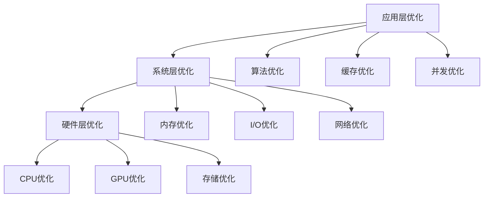

# 13-性能优化指南

## 概述

性能优化是确保VideoAgent系统高效运行的关键环节。本指南将详细说明如何识别性能瓶颈、实施优化策略、监控性能指标，帮助您构建高性能的视频处理系统。

## 性能优化策略

### 优化层次

### 优化原则

1. **测量优先**：先测量再优化
2. **瓶颈识别**：识别真正的瓶颈
3. **渐进优化**：逐步实施优化
4. **效果验证**：验证优化效果
5. **持续监控**：持续监控性能

## 步骤1：性能分析

### 1.1 性能指标定义

**知识点：**
- 关键性能指标
- 性能基准设定
- 性能目标制定

**实现思路：**
1. 定义关键性能指标
2. 设定性能基准
3. 制定性能目标
4. 建立性能监控

**关键指标：**
- 响应时间：请求处理时间
- 吞吐量：单位时间处理量
- 资源使用：CPU、内存、GPU使用率
- 并发能力：并发处理能力
- 错误率：处理错误率

**测试方法：**
- 定义性能指标
- 设定性能基准
- 制定性能目标
- 建立监控体系

### 1.2 性能监控工具

**知识点：**
- 监控工具选择
- 监控指标收集
- 监控数据分析

**实现思路：**
1. 选择监控工具
2. 收集监控指标
3. 分析监控数据
4. 提供监控报告

**监控工具：**
- 系统监控：htop、iostat、vmstat
- 应用监控：APM工具、自定义监控
- 网络监控：netstat、ss、tcpdump
- 数据库监控：数据库性能监控

**测试方法：**
- 验证监控工具
- 测试指标收集
- 检查数据分析
- 验证监控报告

### 1.3 性能瓶颈识别

**知识点：**
- 瓶颈分析方法
- 瓶颈类型识别
- 瓶颈影响评估

**实现思路：**
1. 分析性能数据
2. 识别瓶颈类型
3. 评估瓶颈影响
4. 制定优化策略

**瓶颈类型：**
- CPU瓶颈：CPU使用率过高
- 内存瓶颈：内存不足或泄漏
- I/O瓶颈：磁盘或网络I/O瓶颈
- GPU瓶颈：GPU资源不足
- 算法瓶颈：算法效率低下

**测试方法：**
- 分析性能数据
- 识别瓶颈类型
- 评估瓶颈影响
- 制定优化策略

## 步骤2：算法优化

### 2.1 核心算法优化

**知识点：**
- 算法复杂度分析
- 算法优化策略
- 算法实现优化

**实现思路：**
1. 分析算法复杂度
2. 实施优化策略
3. 优化算法实现
4. 验证优化效果

**优化策略：**
- 时间复杂度优化：降低时间复杂度
- 空间复杂度优化：降低空间复杂度
- 算法选择：选择更优算法
- 实现优化：优化算法实现

**测试方法：**
- 分析算法复杂度
- 实施优化策略
- 测试算法实现
- 验证优化效果

### 2.2 数据处理优化

**知识点：**
- 数据处理流程优化
- 数据格式优化
- 数据压缩优化

**实现思路：**
1. 优化数据处理流程
2. 优化数据格式
3. 实施数据压缩
4. 验证处理效果

**优化内容：**
- 流程优化：优化处理流程
- 格式优化：优化数据格式
- 压缩优化：实施数据压缩
- 缓存优化：实现数据缓存

**测试方法：**
- 测试流程优化
- 验证格式优化
- 检查压缩效果
- 验证处理效果

### 2.3 模型优化

**知识点：**
- 模型结构优化
- 模型量化优化
- 模型推理优化

**实现思路：**
1. 优化模型结构
2. 实施模型量化
3. 优化模型推理
4. 验证模型效果

**优化策略：**
- 结构优化：优化模型结构
- 量化优化：实施模型量化
- 推理优化：优化推理过程
- 批处理优化：优化批处理

**测试方法：**
- 测试结构优化
- 验证量化效果
- 检查推理优化
- 验证模型效果

## 步骤3：缓存优化

### 3.1 缓存策略设计

**知识点：**
- 缓存策略选择
- 缓存层次设计
- 缓存失效策略

**实现思路：**
1. 选择缓存策略
2. 设计缓存层次
3. 实施失效策略
4. 验证缓存效果

**缓存策略：**
- LRU缓存：最近最少使用
- LFU缓存：最少频率使用
- TTL缓存：基于时间过期
- 写回缓存：延迟写入策略

**测试方法：**
- 验证缓存策略
- 测试缓存层次
- 检查失效策略
- 验证缓存效果

### 3.2 缓存实现

**知识点：**
- 缓存数据结构
- 缓存操作优化
- 缓存一致性

**实现思路：**
1. 实现缓存数据结构
2. 优化缓存操作
3. 保证缓存一致性
4. 验证缓存实现

**实现要素：**
- 数据结构：高效的缓存数据结构
- 操作优化：优化的缓存操作
- 一致性：缓存数据一致性
- 并发安全：并发访问安全

**测试方法：**
- 测试数据结构
- 验证操作优化
- 检查一致性
- 验证缓存实现

### 3.3 缓存监控

**知识点：**
- 缓存命中率监控
- 缓存性能监控
- 缓存容量监控

**实现思路：**
1. 监控缓存命中率
2. 监控缓存性能
3. 监控缓存容量
4. 提供监控报告

**监控指标：**
- 命中率：缓存命中率
- 性能：缓存操作性能
- 容量：缓存使用容量
- 效率：缓存效率指标

**测试方法：**
- 验证命中率监控
- 测试性能监控
- 检查容量监控
- 验证监控报告

## 步骤4：并发优化

### 4.1 并发策略设计

**知识点：**
- 并发模式选择
- 并发度控制
- 并发安全保证

**实现思路：**
1. 选择并发模式
2. 控制并发度
3. 保证并发安全
4. 验证并发效果

**并发模式：**
- 多线程：基于线程的并发
- 多进程：基于进程的并发
- 异步IO：基于异步IO的并发
- 协程：基于协程的并发

**测试方法：**
- 验证并发模式
- 测试并发度控制
- 检查并发安全
- 验证并发效果

### 4.2 并发实现

**知识点：**
- 并发框架选择
- 并发任务管理
- 并发资源管理

**实现思路：**
1. 选择并发框架
2. 管理并发任务
3. 管理并发资源
4. 验证并发实现

**实现要素：**
- 框架选择：合适的并发框架
- 任务管理：并发任务管理
- 资源管理：并发资源管理
- 错误处理：并发错误处理

**测试方法：**
- 验证框架选择
- 测试任务管理
- 检查资源管理
- 验证并发实现

### 4.3 并发监控

**知识点：**
- 并发性能监控
- 并发资源监控
- 并发错误监控

**实现思路：**
1. 监控并发性能
2. 监控并发资源
3. 监控并发错误
4. 提供监控报告

**监控内容：**
- 性能：并发处理性能
- 资源：并发资源使用
- 错误：并发错误统计
- 效率：并发效率指标

**测试方法：**
- 验证性能监控
- 测试资源监控
- 检查错误监控
- 验证监控报告

## 步骤5：内存优化

### 5.1 内存使用分析

**知识点：**
- 内存使用分析
- 内存泄漏检测
- 内存优化策略

**实现思路：**
1. 分析内存使用
2. 检测内存泄漏
3. 制定优化策略
4. 实施内存优化

**分析内容：**
- 使用分析：内存使用分析
- 泄漏检测：内存泄漏检测
- 优化策略：内存优化策略
- 效果验证：优化效果验证

**测试方法：**
- 分析内存使用
- 检测内存泄漏
- 制定优化策略
- 验证优化效果

### 5.2 内存管理优化

**知识点：**
- 内存分配优化
- 内存回收优化
- 内存池管理

**实现思路：**
1. 优化内存分配
2. 优化内存回收
3. 实施内存池管理
4. 验证管理效果

**优化策略：**
- 分配优化：优化内存分配
- 回收优化：优化内存回收
- 池管理：实施内存池管理
- 预分配：预分配内存策略

**测试方法：**
- 测试分配优化
- 验证回收优化
- 检查池管理
- 验证管理效果

### 5.3 内存监控

**知识点：**
- 内存使用监控
- 内存性能监控
- 内存告警机制

**实现思路：**
1. 监控内存使用
2. 监控内存性能
3. 实施告警机制
4. 提供监控报告

**监控指标：**
- 使用率：内存使用率
- 性能：内存操作性能
- 泄漏：内存泄漏检测
- 效率：内存使用效率

**测试方法：**
- 验证使用监控
- 测试性能监控
- 检查告警机制
- 验证监控报告

## 步骤6：I/O优化

### 6.1 磁盘I/O优化

**知识点：**
- 磁盘I/O分析
- I/O优化策略
- 存储优化

**实现思路：**
1. 分析磁盘I/O
2. 制定优化策略
3. 实施存储优化
4. 验证优化效果

**优化策略：**
- 顺序I/O：优化顺序I/O
- 随机I/O：优化随机I/O
- 缓存I/O：实施I/O缓存
- 异步I/O：使用异步I/O

**测试方法：**
- 分析磁盘I/O
- 制定优化策略
- 实施存储优化
- 验证优化效果

### 6.2 网络I/O优化

**知识点：**
- 网络I/O分析
- 网络优化策略
- 连接优化

**实现思路：**
1. 分析网络I/O
2. 制定优化策略
3. 实施连接优化
4. 验证优化效果

**优化策略：**
- 连接池：实施连接池
- 压缩传输：数据压缩传输
- 批量传输：批量数据传输
- 异步传输：异步网络传输

**测试方法：**
- 分析网络I/O
- 制定优化策略
- 实施连接优化
- 验证优化效果

### 6.3 I/O监控

**知识点：**
- I/O性能监控
- I/O错误监控
- I/O容量监控

**实现思路：**
1. 监控I/O性能
2. 监控I/O错误
3. 监控I/O容量
4. 提供监控报告

**监控指标：**
- 性能：I/O操作性能
- 错误：I/O错误统计
- 容量：I/O容量使用
- 效率：I/O使用效率

**测试方法：**
- 验证性能监控
- 测试错误监控
- 检查容量监控
- 验证监控报告

## 步骤7：GPU优化

### 7.1 GPU资源管理

**知识点：**
- GPU资源分配
- GPU任务调度
- GPU内存管理

**实现思路：**
1. 管理GPU资源分配
2. 优化GPU任务调度
3. 管理GPU内存
4. 验证GPU管理

**管理策略：**
- 资源分配：GPU资源分配策略
- 任务调度：GPU任务调度优化
- 内存管理：GPU内存管理
- 负载均衡：GPU负载均衡

**测试方法：**
- 测试资源分配
- 验证任务调度
- 检查内存管理
- 验证GPU管理

### 7.2 GPU计算优化

**知识点：**
- GPU计算优化
- GPU内存优化
- GPU并行优化

**实现思路：**
1. 优化GPU计算
2. 优化GPU内存
3. 优化GPU并行
4. 验证优化效果

**优化策略：**
- 计算优化：GPU计算优化
- 内存优化：GPU内存优化
- 并行优化：GPU并行优化
- 批处理优化：GPU批处理优化

**测试方法：**
- 测试计算优化
- 验证内存优化
- 检查并行优化
- 验证优化效果

### 7.3 GPU监控

**知识点：**
- GPU使用监控
- GPU性能监控
- GPU温度监控

**实现思路：**
1. 监控GPU使用
2. 监控GPU性能
3. 监控GPU温度
4. 提供监控报告

**监控指标：**
- 使用率：GPU使用率
- 性能：GPU计算性能
- 温度：GPU温度监控
- 功耗：GPU功耗监控

**测试方法：**
- 验证使用监控
- 测试性能监控
- 检查温度监控
- 验证监控报告

## 步骤8：系统级优化

### 8.1 操作系统优化

**知识点：**
- 系统参数调优
- 内核参数优化
- 系统资源优化

**实现思路：**
1. 调优系统参数
2. 优化内核参数
3. 优化系统资源
4. 验证优化效果

**优化内容：**
- 参数调优：系统参数调优
- 内核优化：内核参数优化
- 资源优化：系统资源优化
- 网络优化：网络参数优化

**测试方法：**
- 调优系统参数
- 优化内核参数
- 测试资源优化
- 验证优化效果

### 8.2 数据库优化

**知识点：**
- 数据库性能优化
- 查询优化
- 索引优化

**实现思路：**
1. 优化数据库性能
2. 优化查询语句
3. 优化索引结构
4. 验证优化效果

**优化策略：**
- 性能优化：数据库性能优化
- 查询优化：SQL查询优化
- 索引优化：数据库索引优化
- 连接优化：数据库连接优化

**测试方法：**
- 测试性能优化
- 验证查询优化
- 检查索引优化
- 验证优化效果

### 8.3 网络优化

**知识点：**
- 网络性能优化
- 网络配置优化
- 网络协议优化

**实现思路：**
1. 优化网络性能
2. 优化网络配置
3. 优化网络协议
4. 验证优化效果

**优化内容：**
- 性能优化：网络性能优化
- 配置优化：网络配置优化
- 协议优化：网络协议优化
- 带宽优化：网络带宽优化

**测试方法：**
- 测试性能优化
- 验证配置优化
- 检查协议优化
- 验证优化效果

## 性能优化最佳实践

### 优化原则

1. **测量优先**：先测量再优化
2. **瓶颈识别**：识别真正的瓶颈
3. **渐进优化**：逐步实施优化
4. **效果验证**：验证优化效果
5. **持续监控**：持续监控性能

### 优化策略

1. **分层优化**：从应用层到硬件层
2. **重点优化**：重点优化瓶颈环节
3. **平衡优化**：平衡性能和资源使用
4. **预防优化**：预防性能问题
5. **持续优化**：持续优化改进

### 优化工具

1. **性能分析工具**：profiler、tracer
2. **监控工具**：系统监控、应用监控
3. **优化工具**：编译器优化、运行时优化
4. **测试工具**：性能测试、压力测试
5. **调试工具**：性能调试、问题诊断

## 故障排除

### 常见问题

**1. 性能下降**
- 分析性能数据
- 识别性能瓶颈
- 实施优化策略
- 验证优化效果

**2. 内存泄漏**
- 检测内存泄漏
- 分析泄漏原因
- 修复泄漏问题
- 验证修复效果

**3. 并发问题**
- 分析并发问题
- 检查并发安全
- 优化并发策略
- 验证并发效果

**4. I/O瓶颈**
- 分析I/O瓶颈
- 优化I/O策略
- 实施I/O优化
- 验证优化效果

### 调试技巧

**调试工具：**
- 性能分析工具
- 内存分析工具
- 并发分析工具
- I/O分析工具

**调试方法：**
- 性能分析
- 内存分析
- 并发分析
- I/O分析

## 下一步

完成性能优化指南后，请继续阅读：
- [14-部署与运维](./14-deployment.md)

## 知识点总结

1. **性能分析**：全面的性能分析方法
2. **算法优化**：核心算法的优化策略
3. **缓存优化**：高效的缓存优化方案
4. **并发优化**：并发处理的优化策略
5. **系统优化**：系统级的性能优化

通过系统性地实施性能优化，您将构建高性能的VideoAgent系统，满足大规模应用的需求。
