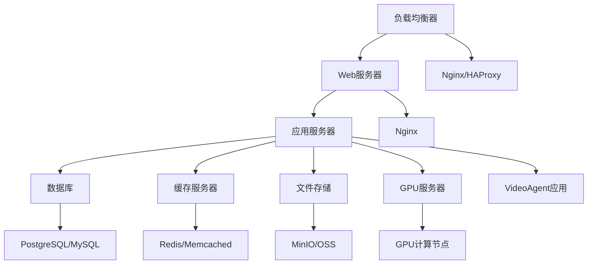

# 14-部署与运维

## 概述

部署与运维是VideoAgent系统生产环境运行的关键环节。本指南将详细说明如何部署VideoAgent系统、配置生产环境、监控系统运行状态，以及处理运维中的各种问题，确保系统稳定可靠地运行。

## 部署架构

### 系统架构

### 部署层次

1. **前端层**：负载均衡、Web服务器
2. **应用层**：VideoAgent应用服务
3. **数据层**：数据库、缓存、存储
4. **计算层**：GPU计算资源
5. **监控层**：监控、日志、告警

## 步骤1：环境准备

### 1.1 服务器规划

**知识点：**
- 服务器配置规划
- 网络架构设计
- 安全策略制定

**实现思路：**
1. 规划服务器配置
2. 设计网络架构
3. 制定安全策略
4. 准备部署环境

**服务器配置：**
- Web服务器：2核4G，用于负载均衡
- 应用服务器：8核16G，用于应用服务
- 数据库服务器：4核8G，用于数据存储
- GPU服务器：8核32G+GPU，用于计算处理
- 存储服务器：4核8G，用于文件存储

**测试方法：**
- 验证服务器配置
- 测试网络架构
- 检查安全策略
- 验证部署环境

### 1.2 网络配置

**知识点：**
- 网络拓扑设计
- 防火墙配置
- 负载均衡配置

**实现思路：**
1. 设计网络拓扑
2. 配置防火墙规则
3. 配置负载均衡
4. 验证网络连通性

**网络配置：**
- 内网：10.0.0.0/16，用于内部通信
- 外网：公网IP，用于外部访问
- 防火墙：配置安全规则
- 负载均衡：配置负载均衡策略

**测试方法：**
- 验证网络拓扑
- 测试防火墙配置
- 检查负载均衡
- 验证网络连通性

### 1.3 安全配置

**知识点：**
- 安全策略制定
- 访问控制配置
- 数据加密配置

**实现思路：**
1. 制定安全策略
2. 配置访问控制
3. 配置数据加密
4. 验证安全配置

**安全配置：**
- 访问控制：基于角色的访问控制
- 数据加密：传输和存储加密
- 安全审计：安全事件审计
- 漏洞扫描：定期漏洞扫描

**测试方法：**
- 验证安全策略
- 测试访问控制
- 检查数据加密
- 验证安全配置

## 步骤2：应用部署

### 2.1 应用打包

**知识点：**
- 应用打包策略
- 依赖管理
- 版本控制

**实现思路：**
1. 设计打包策略
2. 管理应用依赖
3. 控制版本发布
4. 验证打包结果

**打包策略：**
- Docker容器：使用Docker打包
- 虚拟环境：使用虚拟环境隔离
- 依赖管理：管理Python依赖
- 配置文件：管理配置文件

**测试方法：**
- 验证打包策略
- 测试依赖管理
- 检查版本控制
- 验证打包结果

### 2.2 服务部署

**知识点：**
- 服务部署策略
- 服务配置管理
- 服务启动管理

**实现思路：**
1. 设计部署策略
2. 管理服务配置
3. 管理服务启动
4. 验证服务部署

**部署策略：**
- 蓝绿部署：零停机部署
- 滚动部署：逐步更新部署
- 金丝雀部署：小范围测试部署
- 回滚策略：快速回滚机制

**测试方法：**
- 验证部署策略
- 测试服务配置
- 检查服务启动
- 验证服务部署

### 2.3 数据库部署

**知识点：**
- 数据库安装配置
- 数据库初始化
- 数据库备份策略

**实现思路：**
1. 安装配置数据库
2. 初始化数据库
3. 配置备份策略
4. 验证数据库部署

**数据库配置：**
- 主从复制：配置主从复制
- 读写分离：配置读写分离
- 备份策略：定期备份策略
- 监控配置：数据库监控配置

**测试方法：**
- 验证数据库安装
- 测试数据库初始化
- 检查备份策略
- 验证数据库部署

## 步骤3：监控配置

### 3.1 系统监控

**知识点：**
- 系统监控配置
- 监控指标定义
- 监控告警配置

**实现思路：**
1. 配置系统监控
2. 定义监控指标
3. 配置监控告警
4. 验证监控配置

**监控指标：**
- CPU使用率：CPU使用率监控
- 内存使用率：内存使用率监控
- 磁盘使用率：磁盘使用率监控
- 网络流量：网络流量监控

**测试方法：**
- 验证系统监控
- 测试监控指标
- 检查监控告警
- 验证监控配置

### 3.2 应用监控

**知识点：**
- 应用监控配置
- 业务指标监控
- 性能指标监控

**实现思路：**
1. 配置应用监控
2. 监控业务指标
3. 监控性能指标
4. 验证应用监控

**监控内容：**
- 业务指标：用户数、请求数、成功率
- 性能指标：响应时间、吞吐量、错误率
- 资源指标：CPU、内存、GPU使用率
- 日志监控：错误日志、访问日志

**测试方法：**
- 验证应用监控
- 测试业务指标
- 检查性能指标
- 验证应用监控

### 3.3 日志管理

**知识点：**
- 日志收集配置
- 日志存储管理
- 日志分析处理

**实现思路：**
1. 配置日志收集
2. 管理日志存储
3. 处理日志分析
4. 验证日志管理

**日志管理：**
- 日志收集：ELK Stack日志收集
- 日志存储：分布式日志存储
- 日志分析：日志分析和搜索
- 日志告警：基于日志的告警

**测试方法：**
- 验证日志收集
- 测试日志存储
- 检查日志分析
- 验证日志管理

## 步骤4：运维管理

### 4.1 服务管理

**知识点：**
- 服务生命周期管理
- 服务健康检查
- 服务自动恢复

**实现思路：**
1. 管理服务生命周期
2. 配置健康检查
3. 实现自动恢复
4. 验证服务管理

**服务管理：**
- 启动停止：服务启动停止管理
- 健康检查：服务健康状态检查
- 自动恢复：服务故障自动恢复
- 负载均衡：服务负载均衡

**测试方法：**
- 验证服务管理
- 测试健康检查
- 检查自动恢复
- 验证服务管理

### 4.2 配置管理

**知识点：**
- 配置版本管理
- 配置热更新
- 配置一致性保证

**实现思路：**
1. 管理配置版本
2. 实现配置热更新
3. 保证配置一致性
4. 验证配置管理

**配置管理：**
- 版本控制：配置文件版本控制
- 热更新：配置热更新机制
- 一致性：配置一致性保证
- 回滚：配置回滚机制

**测试方法：**
- 验证版本管理
- 测试热更新
- 检查一致性
- 验证配置管理

### 4.3 备份恢复

**知识点：**
- 数据备份策略
- 备份存储管理
- 数据恢复流程

**实现思路：**
1. 制定备份策略
2. 管理备份存储
3. 设计恢复流程
4. 验证备份恢复

**备份策略：**
- 全量备份：定期全量备份
- 增量备份：增量备份策略
- 异地备份：异地备份存储
- 恢复测试：定期恢复测试

**测试方法：**
- 验证备份策略
- 测试备份存储
- 检查恢复流程
- 验证备份恢复

## 步骤5：性能调优

### 5.1 系统调优

**知识点：**
- 系统参数调优
- 内核参数优化
- 系统资源优化

**实现思路：**
1. 调优系统参数
2. 优化内核参数
3. 优化系统资源
4. 验证调优效果

**调优内容：**
- 系统参数：系统级参数调优
- 内核参数：内核参数优化
- 网络参数：网络参数调优
- 文件系统：文件系统优化

**测试方法：**
- 调优系统参数
- 优化内核参数
- 测试资源优化
- 验证调优效果

### 5.2 应用调优

**知识点：**
- 应用参数调优
- 并发参数优化
- 缓存参数优化

**实现思路：**
1. 调优应用参数
2. 优化并发参数
3. 优化缓存参数
4. 验证调优效果

**调优策略：**
- 应用参数：应用级参数调优
- 并发参数：并发处理参数优化
- 缓存参数：缓存参数优化
- 数据库参数：数据库参数调优

**测试方法：**
- 调优应用参数
- 优化并发参数
- 测试缓存参数
- 验证调优效果

### 5.3 监控调优

**知识点：**
- 监控指标调优
- 告警阈值优化
- 监控性能优化

**实现思路：**
1. 调优监控指标
2. 优化告警阈值
3. 优化监控性能
4. 验证调优效果

**调优内容：**
- 监控指标：监控指标优化
- 告警阈值：告警阈值调优
- 监控性能：监控系统性能优化
- 存储优化：监控数据存储优化

**测试方法：**
- 调优监控指标
- 优化告警阈值
- 测试监控性能
- 验证调优效果

## 步骤6：安全运维

### 6.1 安全监控

**知识点：**
- 安全事件监控
- 入侵检测
- 安全审计

**实现思路：**
1. 监控安全事件
2. 实施入侵检测
3. 进行安全审计
4. 验证安全监控

**安全监控：**
- 事件监控：安全事件监控
- 入侵检测：入侵检测系统
- 安全审计：安全审计日志
- 漏洞扫描：定期漏洞扫描

**测试方法：**
- 验证安全监控
- 测试入侵检测
- 检查安全审计
- 验证安全监控

### 6.2 访问控制

**知识点：**
- 访问权限管理
- 身份认证
- 授权管理

**实现思路：**
1. 管理访问权限
2. 实施身份认证
3. 管理授权
4. 验证访问控制

**访问控制：**
- 权限管理：基于角色的权限管理
- 身份认证：多因子身份认证
- 授权管理：细粒度授权管理
- 会话管理：会话安全管理

**测试方法：**
- 验证权限管理
- 测试身份认证
- 检查授权管理
- 验证访问控制

### 6.3 数据安全

**知识点：**
- 数据加密
- 数据备份安全
- 数据传输安全

**实现思路：**
1. 实施数据加密
2. 保证备份安全
3. 保证传输安全
4. 验证数据安全

**数据安全：**
- 存储加密：数据存储加密
- 传输加密：数据传输加密
- 备份加密：备份数据加密
- 访问控制：数据访问控制

**测试方法：**
- 验证数据加密
- 测试备份安全
- 检查传输安全
- 验证数据安全

## 步骤7：故障处理

### 7.1 故障诊断

**知识点：**
- 故障识别
- 故障分析
- 故障定位

**实现思路：**
1. 识别系统故障
2. 分析故障原因
3. 定位故障位置
4. 制定修复方案

**故障类型：**
- 系统故障：操作系统故障
- 应用故障：应用程序故障
- 网络故障：网络连接故障
- 数据故障：数据存储故障

**测试方法：**
- 识别系统故障
- 分析故障原因
- 定位故障位置
- 制定修复方案

### 7.2 故障恢复

**知识点：**
- 故障恢复策略
- 数据恢复
- 服务恢复

**实现思路：**
1. 制定恢复策略
2. 实施数据恢复
3. 实施服务恢复
4. 验证恢复效果

**恢复策略：**
- 自动恢复：自动故障恢复
- 手动恢复：手动故障恢复
- 数据恢复：数据恢复策略
- 服务恢复：服务恢复策略

**测试方法：**
- 制定恢复策略
- 实施数据恢复
- 测试服务恢复
- 验证恢复效果

### 7.3 故障预防

**知识点：**
- 故障预防策略
- 系统健康检查
- 预防性维护

**实现思路：**
1. 制定预防策略
2. 实施健康检查
3. 进行预防维护
4. 验证预防效果

**预防策略：**
- 健康检查：定期健康检查
- 预防维护：预防性维护
- 容量规划：容量规划管理
- 风险评估：风险评估管理

**测试方法：**
- 制定预防策略
- 实施健康检查
- 进行预防维护
- 验证预防效果

## 运维最佳实践

### 运维原则

1. **自动化优先**：优先使用自动化工具
2. **监控先行**：建立完善的监控体系
3. **预防为主**：预防问题发生
4. **快速响应**：快速响应和处理问题
5. **持续改进**：持续改进运维流程

### 运维流程

1. **部署流程**：标准化的部署流程
2. **监控流程**：完善的监控流程
3. **告警流程**：有效的告警流程
4. **故障处理流程**：标准化的故障处理流程
5. **变更管理流程**：严格的变更管理流程

### 运维工具

1. **部署工具**：Docker、Kubernetes、Ansible
2. **监控工具**：Prometheus、Grafana、ELK Stack
3. **日志工具**：ELK Stack、Fluentd、Logstash
4. **告警工具**：AlertManager、PagerDuty、钉钉
5. **管理工具**：Jenkins、GitLab CI、Terraform

## 故障排除

### 常见问题

**1. 服务启动失败**
- 检查配置文件
- 验证依赖服务
- 查看错误日志
- 检查资源使用

**2. 性能问题**
- 分析性能指标
- 检查资源使用
- 优化系统参数
- 调整应用配置

**3. 数据问题**
- 检查数据完整性
- 验证备份策略
- 测试数据恢复
- 修复数据问题

**4. 安全问题**
- 检查安全配置
- 分析安全日志
- 修复安全漏洞
- 加强安全防护

### 调试技巧

**调试工具：**
- 系统监控工具
- 日志分析工具
- 性能分析工具
- 网络分析工具

**调试方法：**
- 分析监控数据
- 查看错误日志
- 使用调试工具
- 检查系统状态

## 下一步

完成部署与运维指南后，您已经掌握了VideoAgent系统的完整复现和运维知识。建议您：

1. **实践应用**：将所学知识应用到实际项目中
2. **持续学习**：关注新技术和最佳实践
3. **经验分享**：与社区分享您的经验
4. **贡献代码**：为开源项目贡献代码
5. **技术交流**：参与技术社区交流

## 知识点总结

1. **部署架构**：完整的部署架构设计
2. **环境管理**：生产环境的管理和配置
3. **监控运维**：全面的监控和运维体系
4. **安全运维**：完善的安全运维策略
5. **故障处理**：标准化的故障处理流程

通过系统性地实施部署与运维，您将确保VideoAgent系统在生产环境中稳定可靠地运行，为用户提供高质量的服务。

