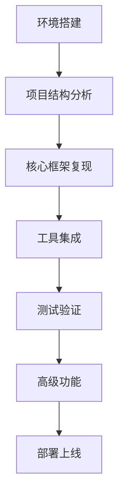

# VideoAgent 项目复现指南

## 项目概述

VideoAgent 是一个基于多模态智能体的视频处理框架，能够通过自然语言对话实现视频的理解、编辑和重塑。本项目复现指南将帮助您从零开始构建一个功能完整的 VideoAgent 系统。

## 核心特性

- **🧠 视频内容理解**：深度分析、摘要提取和洞察挖掘
- **✂️ 视频片段编辑**：直观的组装、剪辑和重新配置工具
- **🎨 创意视频重塑**：利用生成技术制作全新的视频内容
- **🔧 多模态智能体框架**：集成多种AI模态的综合性框架
- **🚀 自然语言体验**：纯对话式AI交互，无需复杂界面

## 技术架构

VideoAgent 采用以下核心技术：

1. **意图分析系统**：智能分解用户指令，识别显性和隐性子意图
2. **自主工具使用与规划**：图驱动的工作流生成和自适应反馈循环
3. **多模态理解**：将原始输入转化为语义对齐的视觉查询
4. **智能体编排**：动态选择和协调多个专业智能体

## 复现文档结构

本复现指南包含以下文档：

### 📋 基础环境搭建
- [01-环境搭建与依赖安装](./01-environment-setup.md) - 详细的环境搭建和依赖安装指南
- [02-项目结构分析](./02-project-structure.md) - 深入分析项目架构和核心组件

### 🔧 核心组件复现
- [03-多智能体框架](./03-multi-agent-framework.md) - 多智能体协调系统的复现指南
- [04-意图分析系统](./04-intent-analysis.md) - 意图识别和分析系统的实现
- [05-图驱动工作流](./05-graph-workflow.md) - 图工作流生成和执行的复现

### 🛠️ 工具集成
- [06-语音合成工具集成](./06-tts-integration.md) - CosyVoice、Fish Speech等TTS工具集成
- [07-视频处理工具集成](./07-video-processing.md) - 视频编辑、转换、优化工具集成
- [08-音频处理工具集成](./08-audio-processing.md) - 音频提取、分离、处理工具集成

### 🧪 测试与验证
- [09-单元测试指南](./09-unit-testing.md) - 全面的单元测试策略和实现
- [10-集成测试指南](./10-integration-testing.md) - 集成测试的设计和执行
- [11-端到端测试](./11-e2e-testing.md) - 端到端测试的场景设计和验证

### 📚 高级功能
- [12-自定义智能体开发](./12-custom-agents.md) - 自定义智能体的开发和集成
- [13-性能优化指南](./13-performance-optimization.md) - 系统性能优化的策略和方法
- [14-部署与运维](./14-deployment.md) - 生产环境部署和运维管理

### 📖 复现总结
- [复现完成总结](./SUMMARY.md) - 完整的复现过程总结和学习指南

## 复现流程概览

## 前置要求

- **操作系统**：Linux (推荐 Ubuntu 20.04+) 或 Windows 10+
- **Python版本**：3.10+
- **GPU内存**：8GB+ (推荐)
- **存储空间**：50GB+ (用于模型文件)
- **网络环境**：稳定的网络连接 (用于下载模型)

## 快速开始

1. **克隆项目**：`git clone https://github.com/HKUDS/VideoAgent.git`
2. **创建环境**：`conda create --name videoagent python=3.10`
3. **激活环境**：`conda activate videoagent`
4. **安装依赖**：`pip install -r requirements.txt`
5. **配置API密钥**：编辑 `environment/config/config.yml`
6. **运行项目**：`python main.py`

## 注意事项

- 本项目复现需要一定的Python和机器学习基础
- 建议按照文档顺序逐步进行，不要跳跃步骤
- 每个步骤完成后都要进行相应的测试验证
- 如遇到问题，请先查看对应文档的故障排除部分

## 技术支持

如果在复现过程中遇到问题，可以：

1. 查看对应文档的故障排除部分
2. 检查项目的GitHub Issues
3. 参考原始项目的README文档

---

**开始您的VideoAgent复现之旅吧！** 🚀
